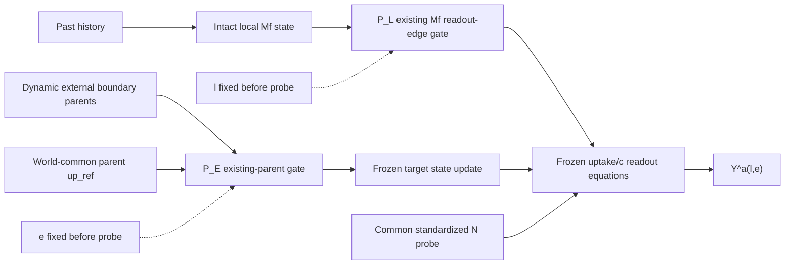
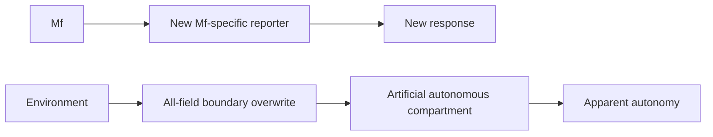

# CAUSAL-ADDRESSABILITY-ARCHITECTURE-01 — Phase 0

## Recommendation

**REVISE — A CONSERVATIVE TWO-PORT CANDIDATE CAN BE SPECIFIED, BUT THE ENVIRONMENTAL PORT IS NOT YET AN ADMISSIBLE INSTRUMENT.**

This Phase 0 accepts `STOP-OWNERSHIP-IDENTIFIABILITY` exactly. It does not reinterpret any prior negative,
unresolved, or feasibility result. No engine, scientific world, seed, checkpoint, reconstruction, outcome-bearing
result, genome, prospective family, V5, or 03G artefact was executed or modified.

The smallest defensible candidate architecture is a wrapper around the frozen engine with:

1. a spatial `lambda_plus(x,t)` port that transiently removes the pre-existing local `m_plus -> uptake` edge on a
   fixed target support without changing `Mf` or any state array; and
2. an environmental incoming-parent port that, during a fixed probe window, replaces the *reads* of an exhaustive
   set of pre-existing external-boundary and world-common parents by a predeclared no-feedback reference, without
   overwriting persistent state or adding a response path.

The natural setting delegates directly to the frozen `step` implementation, so open ports are capable of
bit-identical updates for arbitrary finite synthetic states. That mechanical conservative-extension property does
not transfer any 03G scientific evidence.

The local port is a plausible surgical deletion. The environmental port remains high risk: unless a code-only
synthetic program proves exhaustive edge coverage, no new reporter, no state overwrite, no artificial autonomy,
and an acceptable manipulation path, the disposition becomes **STOP-ARCHITECTURE**. Phase 0 therefore does not
authorize implementation or Stage A.

Even if qualified, this particular E candidate removes only post-`t0` *dynamic environmental innovations* relative
to a retained reference. It cannot supply literal total environmental unavailability. The rank-4 interpretation in
this report is therefore conditional on that declared dynamic-E bundle; the original unrestricted
local/environmental/redundant/relational taxonomy remains unidentified.

## Scope, allowlist, and evidence firewall

The accepted base is `a7d6adbb83dbd0f0219d21c0ba5af4fb57f2ef4c`. Static evidence was restricted to the
allowlist committed beside this report. The source set contains only durable records, the committed
OWNERSHIP-IDENTIFIABILITY theorem/algebra, and seven exact code files required to expand the frozen equations.
`results/`, exposed DEV paths, raw/world shards, checkpoints, scientific analyzers, and broad repository searches
were prohibited.

No prior scientific outcome enters this architecture. Previously exposed DEV paths remain quarantined provenance
limitations.

## Two distinct experiments and namespaces

The following objects must never share arm labels, schemas, estimands, gates, or experimental phases.

| Object | Namespace | Bit meaning | Scientific question | Earliest phase |
|---|---|---|---|---|
| Single-target availability factorial | `Y^a(l,e)` | `l=1`: local readout access open; `e=1`: declared dynamic environmental access open | Which declared existing paths provide causal access to one already-formed state? | C |
| Member-directed cut factorial | `Y_i^k(k_A,k_B)` | `k_i=1`: member `i` local edge cut | Does cutting the local edge at A or B change `Y_A` or `Y_B` directionally? | D, only after C |

The single-target cells are named `L0E0`, `L1E0`, `L0E1`, and `L1E1`. The later member arms may use
`K00/K10/K01/K11`; they must not reuse the `LxEy` namespace. `Y^a` has 1=open. `Y_i^k` has 1=cut.

Phase C can establish causal access through a declared local readout edge and post-`t0` dynamic-E-deviation bundle at
a declared target, support, probe, and horizon. It cannot by itself establish storage locality or the unrestricted
access taxonomy. Phase D can establish directional member-edge dependence. It cannot retroactively change the
Phase-C estimand.

## Independent rank derivation from the 12-row algebra

Let the saturated single-target response model be

`Y^a(l,e) = beta_0 + beta_L l + beta_E e + beta_LE l e + epsilon`,

with design row `x(l,e)=[1,l,e,l*e]`. The four required rows are

```text
x00 = [1,0,0,0]
x10 = [1,1,0,0]
x01 = [1,0,1,0]
x11 = [1,1,1,1]
```

The determinant of the resulting four-row matrix is 1 up to row ordering, so its rank is 4.

Projecting the committed 12 interventions onto clean `l,e` availability support gives:

| Existing intervention | Projection into `Y^a(l,e)` | Why it adds or does not add rank |
|---|---|---|
| Exact clone | `L1E1` | common uncut state only |
| Standardized common probe | `L1E1` | common excitation; not an access factor |
| Qualified own replay | `L1E1` | trajectory-specific no-op, not a cut |
| Global `lam_plus=0` | accepted joint-off control for the committed rank argument | broad equation cut; provides no singleton localization |
| Global `up_ref=0` | undefined as an `l,e` singleton | changes a world-global writer parent only |
| Global passive-copy disable | undefined | changes inheritance, not access to the already-formed state |
| Global `eta_w=0` | undefined | changes new writing; preserves neither singleton access coordinate |
| Local `Mf` erasure | invalid/undefined | destroys the candidate carrier |
| Local reference-`Mf` substitution | invalid/undefined | replaces the candidate carrier |
| Reference replay/no-swap clamp | invalid/undefined | overwrites eight state arrays at the boundary |
| Transplant/core exchange | invalid/undefined | replaces carrier, body, local environment, and seam |
| Non-compact history writer | invalid/undefined | creates a new state/history and changes the estimand |

Under the established charitable projection, the clean support is therefore only `L0E0` and `L1E1`:

```text
X_A0 = [[1,0,0,0],
        [1,1,1,1]]
```

`rank(X_A0)=2`. Two independent null vectors are `[0,1,-1,0]` and `[0,1,0,-1]`. Consequently `beta_L`,
`beta_E`, and `beta_LE` are not uniquely allocated. The local, environmental, redundant, and synergistic response
surfaces agree on the observed diagonal and differ only in the missing singleton cells. The new architecture must
create valid `L1E0` and `L0E1` support; merely adding A/B local cuts does not do so.

## Required counterfactual supports and contrasts

Let `mu_le = E[Y^a(l,e)]` for exact clones that differ only by admitted port settings.

| Support | Local port | Environmental port | Required interpretation |
|---|---:|---:|---|
| `L0E0` | local `m_plus -> uptake` readout edge cut | post-`t0` dynamic external/common innovations standardized to their reference | declared local-edge/dynamic-E-deviation baseline; **not** total joint access-off because the reference environment and other `Mf` edges remain |
| `L1E0` | open | environmental parents standardized | local-edge access with dynamic environment access removed |
| `L0E1` | cut | open | dynamic environmental access with the declared local uptake edge removed |
| `L1E1` | open | open | natural conservative-extension arm |

The primary contrasts are

```text
Delta_L|E0 = mu_10 - mu_00
Delta_L|E1 = mu_11 - mu_01
Delta_E|L0 = mu_01 - mu_00
Delta_E|L1 = mu_11 - mu_10
I_LE       = mu_11 - mu_10 - mu_01 + mu_00
```

The complete truth patterns are:

| Access model | `(mu_00,mu_10,mu_01,mu_11)` after baseline subtraction | Contrasts | Permitted causal-access statement after all gates |
|---|---|---|---|
| Declared local-readout-only | `(0,theta,0,theta)` | both local simple effects `theta`; dynamic-E effects and interaction zero | declared local `m_plus -> uptake` edge is necessary and sufficient conditional on the standardized dynamic-E-deviation bundle |
| Declared dynamic-E-deviation-only | `(0,0,theta,theta)` | both dynamic-E simple effects `theta`; local effects and interaction zero | declared post-`t0` incoming E innovations are necessary and sufficient conditional on local readout deletion |
| Conditional redundant/OR | `(0,theta,theta,theta)` | singleton effects positive only when the other declared path is unavailable; `I_LE=-theta` | either declared local-readout or dynamic-E-deviation path can provide access at this scale |
| Conditional synergistic/AND | `(0,0,0,theta)` | singleton effects positive only when the other declared path is open; `I_LE=+theta` | the declared local-readout and dynamic-E-deviation bundles are jointly required at this scale |
| Assay null | `(0,0,0,0)` | all zero | no access established by this assay; not absence of causal persistence |

These ideal patterns are not decision thresholds. Practical/equivalence margins, world-level inference, missingness,
and multiplicity belong to a later sealed Phase-C preregistration.

These signatures are conditional classifications of two declared path bundles, not a recovery of the unrestricted
ownership taxonomy. In particular, `E0` retains all environmental information present in the reference parents at
`t0`, and `L0` deletes readout edges rather than erasing or locating the candidate state.

### Residual confounding and manipulation artefact contrasts

Every `mu_le` must have a neutral-port sham `mu_le^S` sharing support compilation, window, logging, and clone start
but using open coefficients. Define the predeclared sham-adjusted diagnostic

`A_le = (mu_le - mu_11) - (mu_le^S - mu_11^S)`.

This diagnostic does not automatically remove physical mediators caused by a valid edge cut. It detects wrapper,
scheduling, bookkeeping, or support-path effects. Residual confounding remains whenever:

- any pre-response source-state, body, geometry, probe, or clock equality fails;
- the environment port changes an internal coefficient or local source not declared in the E bundle;
- the local port changes `Mf`, body, environment, or any equation other than the declared readout edges;
- negative-control fields/regions respond like the target;
- face imbalance, boundary work, global-reference leakage, or support motion predicts the response;
- the response appears in a synthetic fixture whose declared causal path is absent;
- active ports and neutral shams differ before the first structurally reachable consequence of the cut.

Any such finding blocks the corresponding causal-access claim rather than being adjusted away statistically.

## Frozen equation decomposition

The frozen update has the following causal parents:

1. signed face flux from `rho,c` transports `rho,U,V,C,Mf`;
2. the uptake equation reads transported `rho,U,V,Mf`, current `N`, and the local memory factor;
3. passive inheritance copies the local intensive `Mf` into new mass;
4. local reaction/diffusion updates `U,V`;
5. the writer reads `N,c,uptake` and world-global `up_ref`, then applies decay, templating, and memory diffusion;
6. `m_minus` changes local attractant production;
7. `c` and `N` receive nearest-neighbour diffusion, local source/decay, and the common nutrient reservoir;
8. the standardized probe resets/pulses `N` as a common declared excitation.

The current arrays are `rho,U,V,c,N,C,uptake,Mf` plus the scheduler step. There is no persistent RNG, previous-state
buffer, or hidden gradient/flux buffer in the accepted serialization schema.

## Minimal conservative extension candidate

### Port API and immutable compilation

The proposed wrapper receives an immutable `AccessPortPlan` compiled before the probe:

```text
AccessPortPlan:
  mode: OPEN | SINGLE_TARGET_ACCESS | LATER_MEMBER_DIRECTIONAL
  target_mask_hash
  boundary_parent_slot_hash
  global_parent_slot_hash
  local_start_step=t0, local_stop_step=t0+1
  environment_start_step=t0, environment_stop_step=t0+H_star
  l_available in {0,1}       # only SINGLE_TARGET_ACCESS
  e_available in {0,1}       # only SINGLE_TARGET_ACCESS
  k_A, k_B in {0,1}          # only LATER_MEMBER_DIRECTIONAL
  reference_parent_hashes
  schedule_hash
```

The support, parent slots, sample-and-hold references, two treatment windows, and response horizon are fixed from the
exact pre-probe clone.
They may not be updated from trackers, later geometry, future response, `P`, `M`, or diagnostic IDs. Ordinary
physics feedback continues; “no-feedback” means the intervention plan and reference values cannot adapt during the
declared horizon.

### Local port `P_L`

Let `Omega` be the fixed target support and `q_L(x,t)` equal 1 outside `Omega`, equal `l` inside `Omega` during the
**first frozen update only**, and equal 1 thereafter. The minimal admitted local-edge candidate is

```text
g_L = dt*g0*rho*N*qq*(1 + beta*sig)*(1 + lambda_plus*q_L*m_plus)
```

The port changes neither `Mf` nor any state value before evaluation. `l=0` deletes one pre-existing
`m_plus -> uptake` edge; it adds no reporter or response path. The `m_minus -> c` edge remains open in every Phase-C
cell because it is downstream of the first-update local diagnostic and adding it would broaden the minimal port. A
future complete-readout bundle could also use

`c_source_L = s*rho0*(1 + lambda_minus*q_L*m_minus)`,

but that requires a separately named longer-horizon estimand and complete causal-cone requalification. Neither the
minimal nor expanded gate locates storage or establishes ownership.

The first-update direct readout

`Y_L,direct(l) = sum_{x in Omega} uptake_x`

is stored immediately after the first active frozen-order uptake evaluation. It is a qualification diagnostic for
the declared local edge, not the Phase-C `L x E` response: because every held E parent equals its open value at `t0`,
`e=0` and `e=1` are structurally identical during that first update. Claiming E access from it would be a rank
illusion.

The Phase-C response `Y_H*^a(l,e)` must instead be evaluated at the first E-reachable horizon `H*`, determined from
the static update graph before scientific use (for a `t0` sample-and-hold in the current explicit update order,
`H* >= 2`). `P_L` reopens before any `Mf` written after the first uptake can itself be read through the gated edge.
The local simple effects at `H*` are therefore total later effects of the transient `t0` deletion of the existing
spatial `m_plus -> uptake` edge, not continued deletion of all later `Mf` readout. The E innovation hold remains
active through `H*`. Readout by a transported `Mf` parcel outside fixed `Omega` is not deleted; that route is
residual or may enter the declared dynamic-E bundle. Therefore even a qualified rank-4 result is a conditional
edge/deviation factorial, not an exhaustive local-state/environmental decomposition.

Any total response `Y_total,H^a` is a separate secondary estimand and is non-exhaustive by default. A future claim of
*complete local-state access* would require a precomputed fixed support covering the full `H`-step stencil causal
cone for every `Mf -> physics -> environment -> target` route. The support may not follow the tracker. If that cone
becomes world-wide, gates noncandidate environmental `Mf`, or destroys meaningful locality, the complete-local claim
is unavailable; it must not be rescued by interpreting the fixed-`Omega` edge result as total access.

For the later Phase-D member experiment, with fixed disjoint supports `Omega_A,Omega_B`, define

`q_L^k = (1-k_A*1_OmegaA)*(1-k_B*1_OmegaB)`.

This multiplication is commutative and idempotent. The later `K00/K10/K01/K11` plan is a separate compiler mode and
schema; it is not part of the Phase-C `LxEy` factorial.

### Environmental port `P_E` — candidate, not admitted

Define `P_E` at *existing parent reads*, never as a collar state overwrite. For every target-destination update,
enumerate each parent read whose source is outside `Omega`. For parent value `z_p(t)` and a predeclared reference
`r_p` captured at the common pre-probe state, use

`z_p^E(t) = r_p + e*(z_p(t)-r_p)`.

Thus `e=1` is the ordinary parent and `e=0` is sample-and-hold standardization. The replacement exists only in the
right-hand-side read; it never writes `z_p`, `Mf`, the collar, or a new state array.

The E bundle must be exhaustive:

| Parent family | Required slots |
|---|---|
| Material/interface transport | cross-boundary `rho,c` reads used by `_face_flux`; donor `U/rho`, `V/rho`, `C/rho`, and `Mf/rho` reads |
| Internal/local diffusion | cross-boundary reads in `lap(u)`, `lap(v)` |
| Carrier organization | cross-boundary reads in `_tmean(m_k)` and `lap(m_k)` |
| Physical environment | cross-boundary reads in `lap(c)` and `lap(N)` |
| World-common writer | the external contribution to `up_ref` |
| Common reservoir | the dynamic `F*(N0-N)` parent contribution, either sample-and-held or explicitly shown irrelevant to the declared E estimand |
| Common standardized probe | **not an E factor**; frozen identical in all cells and arms and logged separately as `P` |
| Clock/tracer | common scheduler step; diagnostic cohort selection cannot enter port support or response assignment |

For the world-global writer reference, the frozen alive predicate and denominator are themselves environmental
parents. Let `A` be the target cells and `B` the external cells. Capture the external sufficient statistics
`S_B0=sum_{x in B} a_x(t0)*uptake_x(t0)` and `n_B0=sum_{x in B} a_x(t0)`, where
`a_x(t)=1[rho_x(t)>1e-4]`. Define

```text
S_A(t) = sum_{x in A} a_x(t)*uptake_x(t)
n_A(t) = sum_{x in A} a_x(t)
S_B(t) = sum_{x in B} a_x(t)*uptake_x(t)
n_B(t) = sum_{x in B} a_x(t)
S_B^E(t) = S_B0 + e*(S_B(t)-S_B0)
n_B^E(t) = n_B0 + e*(n_B(t)-n_B0)

up_ref^E(t) = [S_A(t)+S_B^E(t)] / [n_A(t)+n_B^E(t)]
```

The zero-denominator behavior must be exactly the frozen behavior. At `e=1` the numerator and denominator recover
the frozen `up_ref` exactly even when `P_L` is active. At `e=0`, both external membership and uptake innovations are
held; silently retaining the current external selection or denominator is forbidden. Raw external numerator,
denominator, alive indicators, and substituted scalar are required.

The common standardized `N` probe is exogenous and is not part of E. Define `t0` after the common reset, capture
`r_N`, and let the predeclared per-step probe increment/reset effect be `P(t)`. Every external `N` parent read uses

`N_x^E(t) = r_N(x) + P_x(t) + e*(N_x(t)-r_N(x)-P_x(t))`.

The reservoir then remains the frozen existing function of the selected parent,

`R_N^E(x,t) = F*(N0-N_x^E(t))`,

instead of independently sample-holding the reservoir term. This prevents `e=0` from deleting or double-gating the
common probe. A reset or pulse schedule that cannot be decomposed this way with exact per-step identities makes the
E candidate inadmissible.

These equations standardize new common-parent information relative to the exact pre-probe state. They do not remove
the common standardized probe, which remains an identical separately logged input `P(t)` in all arms.

“Incoming” is a structural dependency, not the sign of realized mass transfer. Every outside-neighbour value that
enters a target-destination update is standardized even when `_face_flux` happens to point outward, because the
external value still determines the magnitude/sign of that update. Target-to-environment destination updates remain
on the frozen path. This directed dependency intervention therefore need not conserve paired face totals; the exact
imbalance is a mandatory manipulation diagnostic and may compel STOP. A symmetric alternative can conserve paired
faces, but it changes both directions and creates a permeability compartment, so it is not silently substituted.

The full frozen parameterization, including ordinary `eta_w`, must be identical in Stages B and C. Changing
`eta_w` between them would make `L1E1` non-natural and is forbidden. The writer and `up_ref` are downstream of the
first-update `Y_L,direct` diagnostic but can enter the `H* >= 2` factorial response, so the global
numerator/denominator gate must qualify. This architecture does not promise a no-new-history scientific factorial;
it preserves the ordinary frozen writer and asks about access in the modified substrate. No claim may borrow the
earlier no-writer constraint or evidence.

The sample-and-hold port tests access through *new dynamic external/common information after the intervention time*,
conditional on the complete pre-probe state. It does not remove environmental information already embodied inside
`Omega`, and it must not be described as total environmental storage erasure.

### Why the E port is not yet admitted

Destination-specific parent substitution is a fixed read-level boundary and can break paired face conservation;
symmetric face gating instead blocks both incoming and outgoing coupling and creates a permeability boundary. Either
can change body/geometry or create apparent autonomy. Sample-and-hold is retained only as an **unadmitted REVISE
candidate** because it is exact at `t0`, changes later outside-parent innovations, and has auditable reference
provenance. It is not total `E0`. Multiplying an alleged additive outside contribution is not a smaller valid port:
the nonlinear shared `_face_flux` has no unique outside summand, while zeroing a Laplacian parent creates a sink.
Such contribution gating is a must-fail artificial-boundary control.

The wrapper is a genuine instrument only if Stage A establishes an exclusion argument at the declared response
horizon:

- every changed arithmetic parent is an existing `E -> target update` parent;
- all cross-boundary neighbour dependencies are covered regardless of realized flux direction, while outgoing
  target-to-environment destination updates remain explicitly frozen;
- no target-internal coefficient, local source, state array, response definition, or reporter is added or changed;
- all E parents are covered, and all non-E parents remain open;
- no disturbance occurs before the first structurally reachable intervention consequence;
- every signed face imbalance, source/sink term, and boundary-work term is zero or explicitly accounted for under a
  frozen synthetic qualification identity; none may explain the target response;
- declared-local-edge-only fixtures are invariant to `P_E`, dynamic-E-only fixtures are invariant to `P_L`, and known
  OR/AND fixtures produce their registered truth tables;
- the candidate response is not reproduced in boundary-only fixtures with no declared access path;
- any apparent reflecting, absorbing, clamped, or autonomous compartment is detected as failure, not evidence;
- every claim remains limited to access from declared post-`t0` dynamic E innovations.

If no formulation meets these conditions without state overwrite, a new reporter, or manufactured autonomy, Stage
A must return `STOP-ARCHITECTURE`.

## Intervention DAGs

### Candidate single-target access DAG



### Invalid manufactured paths



The first graph can at most identify access through declared existing edges. The second creates the decomposition or
autonomy being “discovered” and is inadmissible without a separate scientific question.

## Exact composition laws

Port composition occurs at immutable plan compilation, not by applying one arm to another arm's evolved state. The
local treatment window is exactly one update; the environmental treatment window runs through the statically fixed
`H*` response.

```text
Compile(l,e,Omega,H*) -> (q_L[t0,t0+1), parent_substitution_E[t0,t0+H*], common schedule)
P_L(l1) o P_L(l2) = P_L(min(l1,l2))
P_E(e1) o P_E(e2) = P_E(min(e1,e2))
P_L(l) o P_E(e) = P_E(e) o P_L(l)
```

The final equality is an obligation: the two compilers modify disjoint parent slots and must produce the same
canonical plan bytes, source-state hash, and first update regardless of call order. Nonlinear biological effects
after the common update are the factorial interaction, not failure of compiler commutation.

No arm may be derived from a prior arm. All four start from exact serialized clones with identical state, clock,
probe, target support, horizon, and reference-parent hashes.

## Conservative-extension proof obligations

The natural/open condition is not merely numerically close. The implementation must contain a direct branch:

```text
if plan is None or plan.is_fully_open():
    return frozen_engine.step(state)
```

For arbitrary finite synthetic states of every allowed shape/dtype and scheduler step:

1. `Extended.step(S,None)` must be byte-identical to `Frozen.step(S)` for every returned field and clock;
2. `Extended.step(S,L1E1)` must take the same delegated path and be byte-identical;
3. input state bytes must remain unchanged by `step` calls that promise copy semantics;
4. the state schema must remain exactly `rho,U,V,c,N,C,uptake,Mf,step` with no port/controller state persisted;
5. diagnostics must be computed from copies or emitted ledgers and must never feed physics;
6. open-port equality must hold before any scientific replication is considered;
7. every modified active path must also be compared to a scalar reference at
   `abs(error) <= 1e-12 + 1e-10*abs(reference)`;
8. qualification-only **forced-neutral** execution through the active local kernel with `q_L=1`, through the active
   E kernel with `e=1`, and through both kernels in both compiler orders must be byte-identical to the frozen update.

Bit identity is a mechanical property of the open extension. Stage B must still prospectively re-establish the
scientific phenomenon with both ports open.

## Matched shams and no-feedback controls

Required shams are:

- `S_OPEN`: no plan versus a fully open plan, exact byte identity;
- `S_L`: force the active local kernel with the same target mask, window, compiler, scheduler, bookkeeping, and logs
  as the local cut, but `q_L=1`; require frozen-update byte identity;
- `S_E`: same parent-slot inventory, references, window, compiler, and logs as the environmental standardization,
  but force the active kernel with `e=1`; require frozen-update byte identity;
- `S_LE`: force both neutral active kernels in both orders; require canonical-plan and frozen-update byte equality;
- off-target supports with matched size/face count but no candidate entity;
- synthetic boundary-artifact controls designed to respond to reflection, clamping, sinks, or conservation breaks.

Port masks, reference values, and both unequal treatment windows are frozen at probe start. No tracker update, state-dependent recentering,
future geometry, response, or human intervention may alter them during the no-feedback horizon. Tracker/detector
outputs are passive diagnostics only.

## Raw face, boundary, global, and state diagnostics

Before any scientific response is exposed, every step must record:

- source-state hash and all eight field hashes plus clock;
- `l,e`, compiler mode, separate local/E window hashes, `H*`, target mask hash, boundary face set hash,
  global-parent set hash, and reference hashes;
- for every boundary face and field: axis, endpoints, inside/outside roles, raw parent values, reference values,
  open signed contribution, active signed contribution, and gate coefficient;
- paired-face conservation residual, boundary work/source/sink ledger, and global sum change for every extensive
  field `rho,U,V,C,Mf`;
- weighted/gated laplacian row-sum and constant-field identities for `u,v,m,c,N`;
- raw world `up_ref`; target/external numerator and alive-count denominator; frozen external sufficient statistics;
  substituted value; empty-set branch; and `eta_w` product;
- common reservoir, per-step exogenous `P(t)`, reference `r_N`, residual dynamic N innovation, and recomposed N parent
  separately;
- direct changed-parent slots and a proof that persistent arrays were not overwritten at intervention assignment;
- target/body mass, size, centroid, geometry, boundary distance, fusion/separation, and viability at every step;
- every detector component and tracker association edge/gate term, with diagnostic IDs excluded from physics;
- neutral-sham differences and the earliest structurally reachable response time;
- separate raw response, negative-control region responses, and complete missingness/kill reasons;
- compiler-order plan hashes and update hashes for `P_L o P_E` versus `P_E o P_L`;
- an outcome-firewall certificate showing that response contrasts stayed unavailable until all mechanical gates
  passed.

## Numerical identities and kill switches

Stage A fails closed if any required identity fails:

1. open ports are not byte-identical to the frozen engine on every registered synthetic state;
2. `L1E1` does not delegate directly to the frozen path;
3. local cut changes `Mf` or any non-readout equation parent at assignment;
4. environmental cut writes any state array or adds a reporter/output path;
5. the E parent-slot inventory is incomplete under static dependency audit or sentinel-injection tests;
6. port compilation depends on tracker IDs, future state, future response, final `P`, or material `M`;
7. `P_L` and `P_E` do not compile identically in both orders;
8. E gating creates reflecting/absorbing/clamped autonomy in the boundary-artifact controls;
9. face imbalance, source/sink work, body/geometry disturbance, or negative-control response exceeds a frozen
   synthetic qualification bound;
10. global `up_ref`, reservoir, or common probe is silently omitted, double-gated, or misclassified;
11. the localized `N` probe creates any new `Mf`-specific coupling;
12. passive shadow output is counted as an intervention or used to increase design rank;
13. any scientific world, old 03G result, DEV path, seed, or checkpoint is used in Stage A;
14. any response is opened before the mechanical gate bundle passes;
15. a forced-neutral active kernel differs by any byte from the frozen update;
16. `H*` is selected from observed responses rather than the static graph, the first-update diagnostic is used as an
    E contrast, or fixed-`Omega` results are described as complete local-state access without a full fixed-cone proof;
17. `P(t)` is suppressed, duplicated, or treated as part of E in any cell;
18. Stage B and C use different engine parameters, including `eta_w`;
19. `q_L` remains closed after the first update, so newly written `Mf` is later subjected to the local treatment, or
    the local effect at `H*` is described as anything other than the total effect of the transient `t0` edge cut.

Failures 3–12 return `STOP-ARCHITECTURE`, not a threshold revision. A merely incomplete implementation may return
`REVISE` only before it has been used on any scientific state and without weakening an accepted gate.

## Alternative comparison

| Candidate | Adds interventional rank? | State overwrite/new path? | Strength | Fatal limitation or claim boundary | Disposition |
|---|---:|---|---|---|---|
| Transient spatial `lambda_plus(x,t)` only | one local factor if E exists | no overwrite; deletes existing edge for the first update | smallest credible local surgery; touches the already-formed state before new writing can be reread | establishes only conditional `m_plus -> uptake` edge necessity/total consequences; not local storage or full local state | primary Phase-C `P_L` candidate |
| Complete local `Mf` readout bundle | one local factor if E exists | no overwrite; deletes existing `m_plus` and `m_minus` edges | exhausts explicit `Mf -> physics` readouts | requires a longer horizon/full-cone requalification; can gate noncandidate environment; still not storage locality | future separately named extension only |
| Incoming-parent sample-and-hold E bundle | one conditional dynamic-E factor if exhaustive and admitted | no persistent overwrite or reporter | exact at `t0`; addresses existing boundary/global innovations and preserves persistent state | retains baseline E information; can break conservation or manufacture quasi-autonomy; exclusion unproved | unadmitted `P_E` candidate, REVISE |
| Outside-contribution multiplier | no valid general factor | changes nonlinear face/laplacian semantics | superficially small | `_face_flux` has no unique outside summand and zeroing a Laplacian parent creates a sink | reject; must-fail artefact control |
| Symmetric face permeability gate | one E-like boundary factor | no overwrite | conservative paired-face formulation can preserve totals | also blocks target-to-environment paths and creates a compartment | reject as primary; boundary-artifact control |
| Local `N/sigma` uptake operand standardizer | one narrow environmental-readout factor | no overwrite | smaller than full boundary bundle | omits transport, diffusion, templating, reservoir, and global paths | insufficient for full E |
| Existing all-field collar replay | syntactically active | **overwrites eight arrays** | exact declared boundary values | artificial boundary and prior mechanical failure | reject |
| Localized ordinary `N` probe | probe factor, not E availability | admissible only with existing N coupling | maps susceptibility/receptive field | no access cut; new `Mf` reporter forbidden | retain only as common/probe diagnostic |
| Passive shadow-reader | **0** | no feedback if truly passive | decodability and numerical counterfactual diagnostics | observational; cannot increase interventional rank | auxiliary only |
| Active ghost/reporter | apparent rank only | **adds a new path** | can force a response | manufactures access by construction | reject |

## Claims table

| Evidence package | Strongest permitted claim | Forbidden claim |
|---|---|---|
| Open-port byte identity | extension is mechanically conservative when open | 03G scientific result transfers |
| Local `lambda_plus` cut only | declared pointwise `m_plus -> uptake` edge contributes under this probe/horizon | local storage, ownership, complete local access |
| Complete local readout bundle, future longer-horizon cone qualified | explicit local `Mf -> physics` edges are necessary/sufficient conditional on the admitted dynamic-E intervention | `Mf` is stored or owned only locally; any route outside the proved cone |
| Qualified E bundle | response depends on declared post-`t0` dynamic boundary/common innovations | all environmental information is removed; natural autonomy |
| Rank-4 Phase C with declared local pattern | local readout-edge causal access conditional on the dynamic-E reference at the declared scale | material or metaphysical ownership; unrestricted local-only access |
| Rank-4 Phase C with declared dynamic-E pattern | post-`t0` environmental/common innovation access at the declared scale | no local storage or no local information |
| Rank-4 Phase C with conditional OR pattern | redundancy between the declared L and dynamic-E bundles | every possible route is redundant |
| Rank-4 Phase C with conditional AND pattern | synergy between the declared L and dynamic-E bundles | an individual is owned by the pair/environment; unrestricted relational dependence |
| Passive shadow agreement | local state is decodable or model-predictive | causal necessity or increased intervention rank |
| Localized ordinary N probe | spatial susceptibility/directional propagation through existing N coupling | storage or access location |
| Later Phase-D A/B factorial | directional member-edge dependence after Phase-C access qualification | Phase-C L/E decomposition or ownership by itself |

Prefer “causal access structure.” The term “ownership” remains unauthorized unless a later program establishes
locality, sufficiency, exclusion, and storage rather than only readout-edge dependence.

## Staged revalidation and preregistration roadmap

Each stage requires its own human-reviewed package and authorization. Passing one stage does not authorize the next.

### Stage A — code-only synthetic qualification

No scientific world or seed. Implement only after a new authorization:

1. exact open-path delegation and arbitrary-state byte-identity suite;
2. forced-neutral active-local, active-E, and joint/order byte identities, plus scalar-reference active-path tests at
   the frozen float64 criterion;
3. immutable compiler, namespace, polarity, clone, order, and no-feedback tests;
4. static dependency enumeration plus sentinel perturbations for every E parent slot;
5. static proof of the first E-reachable horizon `H*`, first-update E invariance, exact one-update local-window
   reopening before newly written `Mf` can be gated, and sentinel tests showing exactly where escaped/outside `Mf`
   readout enters; a complete-local fixed-cone construction is optional and separately qualified;
6. declared local-only, dynamic-E-only, conditional redundant/OR, conditional synergistic/AND, assay-null, and
   boundary-only/artificial-autonomy fixtures;
7. face conservation, fully accounted source/sink/boundary-work, constant-field, symmetry, reservoir, external
   `up_ref` numerator/denominator, and exact `r_N+P+innovation` identities;
8. passive shadow and localized-N negative tests proving they add no intervention rank/path;
9. independent adversarial source review and final `GO_TO_B` or `STOP-ARCHITECTURE`.

### Stage B — fresh open-port persistence/turnover replication

Only after a sealed Stage-B preregistration and fresh prospective namespace:

1. both ports remain open and delegate to the frozen equations;
2. prospectively re-establish formation, causal persistence, deep turnover survival, viability, tracker/cadence/time
   robustness, and expected null controls in the extended architecture;
3. freeze the complete engine/probe parameterization, including ordinary `eta_w`, for use unchanged in Stage C;
4. use no old 03G effect, valid-world set, threshold margin, seed, or scientific result as confirmation;
5. stop if the new substrate does not independently reproduce the prerequisite phenomenon.

### Stage C — separately sealed single-target `L x E` access factorial

Only after Stage B passes:

1. persist exact new deep checkpoints under the modified architecture;
2. freeze one target/support rule without diagnostic IDs or outcomes;
3. exact-clone `L0E0/L1E0/L0E1/L1E1` with separate shams;
4. close `q_L` only for the first frozen update and reopen it before newly written `Mf` can be read; retain
   first-update `Y_L,direct(l)` only as a local-edge qualification diagnostic; keep the E innovation hold active
   through the statically fixed first E-reachable `Y_H*^a(l,e)` factorial response; interpret local simple effects
   only as later total effects of the transient `t0` edge cut;
5. keep `Y_total,H^a` secondary and do not call fixed-`Omega` effects complete local-state access without a separate
   full-cone qualification;
6. predeclare margins, inference, multiplicity, missingness, manipulation gates, and hard cap;
7. expose `Y^a` only after the entire mechanical firewall passes;
8. preserve the exact Stage-B engine/probe parameterization;
9. classify only access through the declared local-readout and post-`t0` dynamic-E-deviation bundles.

### Stage D — later A/B directional-individuality factorial

Only after Phase C establishes an admissible access decomposition:

1. new scientific question, schema, preregistration, seal, and prospective namespace;
2. use `Y_i^k(k_A,k_B)` and `K00/K10/K01/K11`, never `LxEy` labels;
3. require continuously separated viable A/B entities, exact clones, fixed member supports, composition, fusion and
   tracker independence, and full non-symmetrized `Y_A/Y_B` matrix;
4. do not treat Phase-D directional effects as proof of Phase-C environmental exclusion or local storage.

## Exact next action

Human architectural review of this Phase-0 candidate only. Do not implement Stage A under this mission.

After review, the disposition choices are:

- **REVISE / AUTHORIZE SYNTHETIC STAGE A** only if the incoming-parent E bundle and exclusion targets are accepted
  as a legitimate test of dynamic environmental access;
- **STOP-ARCHITECTURE** if human review concludes that the E port necessarily overwrites state, adds a reporter,
  creates an autonomous boundary, or lacks an exhaustive existing-edge definition;
- never GO directly to a scientific or prospective stage.
