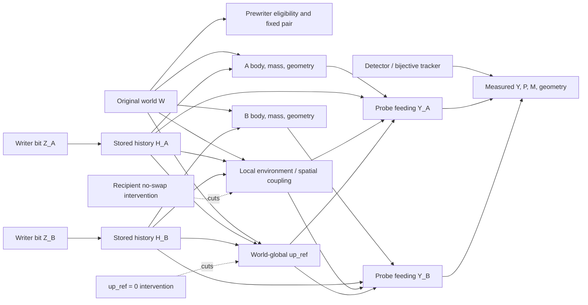

# DIRECTED-CAUSAL-PAIR-00 — Phase 0 report

Status: **COMPLETE FOR PHASE 0 — REVISE — NO PROSPECTIVE AUTHORIZATION**
Question: **Can two natural, separated, non-fusing droplets be distinguished as two directed causal individuals?**

## Independent judgement

**REVISE.** The existing record supports a credible experiment but not an immediate prospective `GO`.

Four already-open DEV worlds contain three natural targets that remain tracker-distinct through deep turnover, and a
pair chosen before treatment remains above the frozen 24-cell separation threshold at the initial and deep
snapshots. The corrected common feeding probe, exact cloning/serialization machinery, `up_ref=0` ablation, and
single-recipient no-swap operator already exist. This establishes **compositional plausibility**.

It does not yet establish pair-specific mechanical readiness. The raw DEV trajectory does not store per-step pair
distance or halo overlap. The qualified no-swap record used one target at a time in no-history continuations, not a
history-bearing recipient beside a history-bearing partner. The `H00/H10/H01/H11` pair clone set has never been
executed even outcome-blind on DEV. Only four original worlds qualify, which is feasibility evidence and not a basis
for confirmatory matrix inference. Calling this `GO` would overstate what was tested; calling it `STOP` would ignore a
short, testable closure path.

## Exact parent and provenance

The isolated branch starts from:

`7deeb8e0bd4ac972e1dd133fc8992fcfc4f2fb2b` — `docs: report no-transplant access feasibility`

This is the minimal accepted parent because it is the first linear point that contains both the implemented
no-transplant/no-swap qualification (`33c340e150905997d723f4cce44c259353ff0102`) and its explicit mechanics report,
while retaining the accepted 03G causal-turnover lineage and corrected non-fusing probe. It predates later
ACCESS-STRUCTURE phases and later downstream reader work.

Reused accepted components:

| Component | Introduction commit | SHA-256 at parent | Role here |
|---|---|---|---|
| 03G local writer/executor | `7f005bca81e1a8bbd03ca9aa8f7d114931a686a9` | `7a7736d2c95b08e073327bfa6984cefa6d8055da49943ced887567ae6cddc8f9` | unchanged local Gaussian history writer |
| original writer constants | `8b2e12da952f4f54754192aa00a0e44482999dda` | `134dc3550f8f36dcb762d799a2bb6d3a0f60a75cf1bce2e91ed19b8d9a5ecdad` | `K=3`, size 45, separation 24, two 60-step phases, amplitude range `[0.005,0.035]` |
| corrected non-fusing probe | `9b7580bc3a09293a4b0b19b70cff8c39c5cb1378` | `9ca619eaed2b5b560acaed06fe2cee8b9339d2299d0d1320d79a0cd897510655` | `N:=N0`, settle 40, uniform 0.25 for 5, horizon 40 |
| bijective tracker | `647051382f64512508fd0602603f3d001b505529` | `c799c17f1af4556e0cc66eb2305f8e4b1846beeb5cf4c4ae0648d2ab6b76ca4b` | geometry-only one-to-one identity with censoring |
| no-swap operator | `33c340e150905997d723f4cce44c259353ff0102` | `08ae4c43967bbef4fff28de5eb3cf9d7bdf12b2250d92e7da0ce4bfe75274401` | radius-10 core, two-cell reference-replay ring |

The input artefacts are hash-bound in
`DIRECTED_CAUSAL_PAIR_00_PHASE0_DEV_FEASIBILITY.json`. Their SHA-256 values are:

- `turnover_dev_raw.json`: `dd326f0a31b829c8961b660b4a31533c789c19f407d2ccdc22b44fd9d48c8f54`;
- Phase-0.5 qualification: `15ed040fe61465ce4a389997bbc2e636a62a7dbd1d040116c26acdd88b8d5b87`;
- Phase-0.6B no-swap results: `100ecb994718153d3e898b610a9b80b2c5ea74005d41493cd9cc0988fa6edee6`.

No V5 or 03G source/raw artefact was modified, replaced, or merged. No `58xxx` raw file or seed was enumerated,
opened, reserved, or executed; that namespace remained read-only and outside the audit. The Phase-0 script accepts
only the already-open `50001–50010` records and fails if an input seed lies outside that set.

## DEV feasibility audit

The outcome-blind selection rule is maximum **initial** toroidal centroid separation, ties by ascending target-index
pair. It does not use history, future feeding, deep geometry, or any pair contrast. A/B orientation is even-world
ascending and odd-world descending; this label never enters physics or tracker association. The third target is a
sentinel.

| Original world | A | B | Sentinel | initial distance | deep distance | minimum endpoint radius-12 halo gap |
|---:|---:|---:|---:|---:|---:|---:|
| 50002 | 0 | 2 | 1 | 35.254603 | 34.372571 | 10.372571 |
| 50004 | 0 | 1 | 2 | 29.300651 | 29.242058 | 5.242058 |
| 50005 | 1 | 0 | 2 | 33.601990 | 32.971138 | 8.971138 |
| 50007 | 1 | 0 | 2 | 32.975667 | 32.222764 | 8.222764 |

All four have:

- empty turnover `first_censor` records, hence no logged split, fusion, loss, ambiguity, or tracker switch;
- three deep targets with the existing G0-valid probe continuation;
- joint deep material-overlap values retained per target, not collapsed into a composite;
- pairwise-disjoint Phase-0.5 radius-10 core blocks and all bodies contained in their cores;
- 12/12 existing single-target no-swap qualifications with bit-exact isolation under `up_ref=0`, viable ordinary,
  own-replay, and reference-replay continuations.

The six excluded DEV worlds were not replaced post hoc: 50001 split target 1 at step 153; 50003 lost target 2 at
step 236; 50006 split target 0 at step 692; 50008 and 50010 had fewer than three eligible targets; 50009 split
target 0 at step 436.

The audit cannot claim continuous radius-12 halo non-overlap because the existing turnover raw stores centroids only
at initial and deep snapshots. The future minimum schema therefore requires pair distance and exact halo-overlap
cell count at every recorded step, plus all association alternatives and individual gate terms.

## Mechanical feasibility of the four clones

The four-arm history intervention is structurally compatible with the existing state object and writer:

| Arm | A writer | B writer | Interpretation |
|---|---:|---:|---|
| `H00` | no-op | no-op | common counterfactual/reference |
| `H10` | existing writer | no-op | A source only |
| `H01` | no-op | existing writer | B source only |
| `H11` | existing writer | existing writer | joint history |

One pair-outcome-blind amplitude tuple from the existing two-phase distribution is used identically at A and B.
All four arms run the same loop and array expression, with the two treatment bits as the only writer difference.
Complete persistent states can already be copied/serialized exactly, and Phase-0.5 reported zero round-trip,
continuation, no-op, and same-source-reinsert errors.

The correct judgement is nevertheless **not yet pair-qualified**. A new DEV-only mechanical check must demonstrate
the exact four prewriter hashes, equal writer operation counts, common H00-derived deep step, all-arm tracker
validity, continuous separation/halo gates, and a recipient no-swap/sham in the presence of the treated partner. It
must suppress Y/C/I contrasts so that feasibility is not selected from the pair result.

## Causal DAG



The body/mass/geometry nodes are downstream of the writer and upstream of feeding. Adjusting them away would change
the question from total causal effect to a controlled direct effect and is forbidden in the primary analysis.
Residual nutrient, clamp discontinuity, outside-target field changes, and the sentinel are contamination/channel
diagnostics, not selection variables.

## Directed matrix and factorial estimands

The matrix convention is row = recipient/outcome and column = written source:

```text
        source A   source B
out A     C_AA       C_AB     (C_AB is B -> A)
out B     C_BA       C_BB     (C_BA is A -> B)
```

Each entry is the marginal 2×2 factorial effect of its source writer, averaged across the other writer bit within the
same original world. `C_AB` and `C_BA` stay separate. `I_A` and `I_B` are the ordinary factorial interaction effects
on each recipient. Exact equations are frozen in the draft preregistration.

The primary matrix is under ordinary coupling. Recipient-A and recipient-B no-swap branches diagnose spatial/local
environment routes separately; `up_ref=0` diagnoses the world-global route; combined recipient-cut plus `up_ref=0`
checks unexplained residual access; own-replay is the matched clamp sham. No simultaneous two-recipient clamp is
needed.

## Hypothesis map

| Hypothesis | Distinguishing evidence, subject to future frozen margins |
|---|---|
| `H_I` | diagonal effects with off-diagonals equivalent to zero; diagonal persistence through local/global cuts |
| `H_ENV` | recipient-specific cross effect attenuated by recipient no-swap beyond sham |
| `H_PAIR` | pair-local off-diagonal effect surviving `up_ref=0` and changing under the corresponding recipient cut |
| `H_ASYM` | nonzero/non-equivalent world-level `C_AB-C_BA`, with no chosen direction after observation |
| `H_REL` | non-additive `I_A` or `I_B` not explained by sham, global, or clamp diagnostics |
| `H_GLOBAL` | pair and sentinel effects co-move and collapse under `up_ref=0` rather than recipient no-swap alone |
| `H_0` | all matrix entries and interactions inside frozen null/equivalence regions with valid controls |

These labels are not automatic conclusions. A cross effect is directed influence, not by itself relational
individuality; a clean diagonal is local persistence, not ownership.

## Raw schema and contamination accounting

The draft raw schema adds only what the directed causal question requires:

- exact prewriter clone and later state hashes;
- fixed pair choice, reciprocal orientation, writer tuple, per-target dose, and equal-operation audit;
- per-step joint P/M, frozen raw descriptors, lineage/mask hashes, all association edges, every gate term, and chosen
  assignment;
- per-step A–B distance and discrete halo overlap;
- integrated tracked uptake plus fixed-mask control;
- mass, size, centroid, and halo measures as mediators;
- local residual `N`, `up_ref`, sentinel response, barrier jump, immediate core change, and outside-target change as
  contamination/environment/global diagnostics;
- whole-world validity and censor reason.

It adds no generic feature battery, reader, decoder, symmetry constraint, or identity composite.

## Controls and kill switches

The draft preregistration specifies fail-closed gates for:

1. outcome-independent eligibility, pair choice, A/B orientation, writer tuple, reference path, and deep time;
2. byte-identical prewriter clones;
3. detector/tracker identity and complete association-edge/gate logging;
4. no fusion, split, loss, ambiguity, component switch, giant component, or sentinel failure;
5. 24-cell minimum separation and zero radius-12 halo overlap at every recorded step;
6. reciprocal H10/H01 and recipient-A/B arms without symmetrization;
7. byte-identical own-replay sham;
8. identical A/B target dose and numerical writer operations;
9. common deep turnover step with joint P/M preservation;
10. the unchanged common corrected probe;
11. one original world as one statistical unit;
12. no dropping by Y/C/I sign or magnitude;
13. at least 18 whole valid original worlds at a separately frozen hard cap, otherwise
    `FEASIBILITY_FAIL / QUESTION UNANSWERED`;
14. a DEV-only pair-context mechanical qualification before prospective preseal.

The value 18 is inherited as a conservative structural floor from 03G, not presented as power for this new directed
matrix. Effect margins, equivalence regions, multiplicity, hard cap, platform binding, and prospective namespace
remain intentionally unsealed.

## Deliverables and decision

- reproducible DEV audit:
  `experiments/individuation/directed_causal_pair_phase0_audit.py`;
- audit contract tests:
  `experiments/individuation/test_directed_causal_pair_phase0.py`;
- machine-readable result:
  `docs/individuation/DIRECTED_CAUSAL_PAIR_00_PHASE0_DEV_FEASIBILITY.json`;
- draft preregistration:
  `docs/individuation/DIRECTED_CAUSAL_PAIR_00_PREREGISTRATION_DRAFT.md`;
- minimum raw schema:
  `docs/individuation/DIRECTED_CAUSAL_PAIR_00_RAW_SCHEMA_DRAFT.json`.

**Decision: REVISE.** The exact next authorized action is one outcome-blind mechanical qualification using only the
already-open 500xx DEV worlds. It may build the four clone arms and pair-context recipient clamp/sham, record only
mechanical validity/geometry/contamination, and must not compute or inspect Y/C/I pair contrasts. Phase 0 stops here
for review. No prospective seed namespace is opened, inspected, reserved, or executed.
