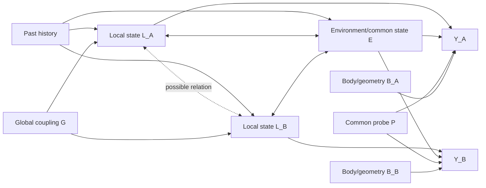
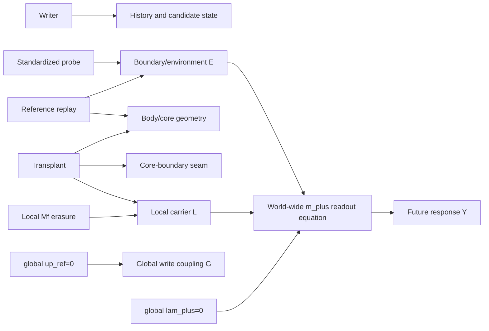
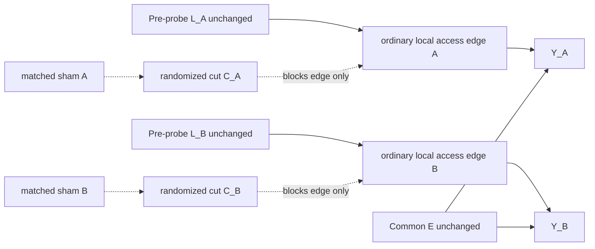

# OWNERSHIP-IDENTIFIABILITY-00 — Phase 0 theory and static audit

## Disposition

**STOP — OWNERSHIP IS NOT IDENTIFIABLE UNDER THE CURRENT INTERVENTION ALGEBRA.**

This is an identifiability stop, not a scientific null. It accepts without reinterpretation:

- 03G Outcome B: causal persistence survives turnover; ownership was not established;
- `STOP-TRANSPLANT`;
- `STOP-CORE-SUFFICIENCY`;
- `STOP_PAIR_MECHANICS`;
- `STOP-LOCAL-CUT`;
- downstream `NO_ACCESS_ESTABLISHED`.

No realized scientific outcome is used in the argument. No engine, seed, checkpoint reconstruction, prospective
family, genome, V5, or 03G artefact was executed or modified. The conclusion follows from the maps implemented by
the existing interventions and from the rank of the potential-outcome design they can support.

The current algebra can identify dependence on a globally removed equation term, dependence on a destructively
erased carrier, exactness of a clone or sham on its own qualified trajectory, and the mechanics of a writer or
state surgery. It cannot allocate an already-formed causal state to a local, environmental, redundant, or
relational owner because no qualified intervention changes only an access edge while preserving that state and
its environment.

## Scope and immutable provenance

This audit is rooted at accepted commit `afa05ee82e2663e252e401dded587bcf060833b2`. The following implementations
were inspected statically:

| Implementation | SHA-256 |
|---|---|
| `edlab/experiments/sc_mcm/engine.py` | `d51a5db1848e717a44f9e00aa4ad4b9c86465ec245184b78b2516dad9842ef2d` |
| `experiments/individuation/causal_confirm.py` | `134dc3550f8f36dcb762d799a2bb6d3a0f60a75cf1bce2e91ed19b8d9a5ecdad` |
| `experiments/individuation/turnover_diag_engine.py` | `8ba3ac5650cb460d68642d8f4077f3334067ff264c6e976b34364b5bc294480a` |
| `experiments/individuation/turnover_engine_03g.py` | `7a7736d2c95b08e073327bfa6984cefa6d8055da49943ced887567ae6cddc8f9` |
| `experiments/individuation/access_structure_operators.py` | `ca7a68fcf0d35dfcf4b766f64a1ff5b007678191befe28360b54c341fb537d8f` |
| `experiments/individuation/access_structure_noswap_operators.py` | `08ae4c43967bbef4fff28de5eb3cf9d7bdf12b2250d92e7da0ce4bfe75274401` |
| `experiments/individuation/directed_causal_pair_phase05_mechanics.py` | `7e37df20a673f146413961a91fe5655b9a08d8a0625fa42c5cf81ed7b1bdc6ad` |
| `experiments/individuation/directed_causal_pair_phase05_executor.py` | `66b54dbc53168e4d85e6b4ba99335226becb71e3d3954aca91b1a8d4361d8dac` |

The conflicting `ACCESS-STRUCTURE-00` digests and exposed 500xx DEV paths are provenance limitations, not an
invitation to reconstruct a state or inspect an outcome. They are not resolved here. The accepted stop records are
premises; no scientific result is reanalysed.

One audit command displayed outcome-bearing summary text from the downstream report before the firewall was
tightened. Those values were quarantined immediately and play no role in any model, table, proof, comparison, or
decision below. No raw shard, world result, contrast table, or reconstruction was opened.

## Variables and estimands

At the instant immediately before a common probe, let:

- `L_i` be the inherited candidate state local to member `i` (`i` is A or B), including any local carrier that
  would be destroyed by `Mf` erasure;
- `E` be the contemporaneous boundary, environmental, and world-common state not assigned to a member;
- `R_i` be the ordinary engine path by which `L_i` may influence a future response;
- `G` be a world-global coupling, including the scalar `up_ref` where relevant;
- `P` be the common standardized probe;
- `B_i` be body and geometry state;
- `Y_A`, `Y_B` be separate future responses;
- `a_L`, `a_E` be hypothetical binary availability gates for the local and environmental access channels. These
  are mathematical gates, not existing engine parameters;
- `k_A`, `k_B` be hypothetical member-specific cut bits, with 0 meaning ordinary access and 1 meaning cut.

“Ownership” means a causal allocation of the inherited state’s access to the response, not mere spatial
decodability, correlation, or the location where a probe is applied.

For one response, define the saturated availability model

`Y^a(a_L,a_E) = beta_0 + beta_L a_L + beta_E a_E + beta_LE a_L a_E + epsilon`.

For a two-member addressability experiment define

`Y_i^k(k_A,k_B)`, for `i in {A,B}`, and retain every ordered contrast. In particular, the row is the responding
member and the column is the cut member:

`C_ij = Y_i^k(k_j=0,k_-j=0) - Y_i^k(k_j=1,k_-j=0)`.

Do not symmetrize `C_AB` with `C_BA`. The member-specific interaction is

`I_i = Y_i^k(1,1) - Y_i^k(1,0) - Y_i^k(0,1) + Y_i^k(0,0)`.

The superscripts prevent a polarity collision: `Y^a` uses 1=available, whereas the member-arm response `Y_i^k`
uses 1=cut.

## Competing causal models

Let `mu` be an unconstrained baseline and let `theta != 0` denote the inherited-state contribution at the declared
scale. The five hypotheses are defined by their complete local/environment availability tables:

| Model | `Y^a(0,0)` | `Y^a(1,0)` | `Y^a(0,1)` | `Y^a(1,1)` | Causal meaning |
|---|---:|---:|---:|---:|---|
| `H_L` local | `mu` | `mu+theta` | `mu` | `mu+theta` | the local channel is necessary and sufficient conditional on the common controls |
| `H_E` environmental | `mu` | `mu` | `mu+theta` | `mu+theta` | the environmental/common channel carries the effect; the local record may be a correlate |
| `H_R` redundant | `mu` | `mu+theta` | `mu+theta` | `mu+theta` | either local or environmental access is sufficient; both must be absent to remove access |
| `H_S` synergistic/relational | `mu` | `mu` | `mu` | `mu+theta` | neither channel alone is sufficient; the joint relation is causal |
| `H_0` narrow null | `mu` | `mu` | `mu` | `mu` | no addressable inherited-state contribution to this declared response and intervention scale |

`H_0` is deliberately narrow. Accepted 03G Outcome B rules out a broad claim that no causal persistence exists.
Here `H_0` means only that the proposed addressability assay exposes no owned channel at its declared scale.

The pair version permits member-specific coefficients. A diagonal pattern supports member-local access; ordered
off-diagonal effects support crossed access; a similar change in both rows after either cut supports common-mode or
environmental mediation; an interaction with weak or absent single cuts supports redundancy or relational
dependence depending on the four-cell pattern. These are diagnostic patterns only after cut confinement,
state-preservation, sham, viability, and composition gates pass.

## Causal graphs

### Frozen system and ownership ambiguity



The optional arrows are precisely what must be distinguished. Natural co-formation places `L` and `E` on a
coupled support; observing the intact system cannot assign the active arrow.

### Where existing interventions act



No existing arrow targets only `L -> Y` or only `E -> Y` while leaving the source nodes and all other incoming
paths invariant.

### Required edge intervention



The diagram is a requirement, not an implementation proposal. If the edge cannot be cut without changing `L`,
`E`, body, geometry, or the response definition, then ownership in the frozen substrate remains unidentifiable.

## Formal intervention algebra

`clean 2x2` means a factorial of independently available A and B access cuts, not merely that two instances of a
destructive operation can be called.

| Intervention | Exact variables changed | Localized? | Candidate state preserved before probe? | Environment/body/geometry perturbation | Clean `C00/C10/C01/C11`? | Claims it can identify | Claims it cannot identify |
|---|---|---|---|---|---|---|---|
| Global `lam_plus=0` | Changes the single scalar engine parameter multiplying `tanh(m_plus)` in uptake at every cell; subsequent `uptake,N,rho,U,V,C,Mf,c` can diverge dynamically | No, world-global coefficient | Arrays initially yes; ordinary access mechanism no | Changes feeding/readout and therefore future body/environment globally | No member-specific composition | Necessity of that equation term for a declared response, under its global ablation | Spatial owner, member address, local versus environmental source, or absence of other paths |
| Global `up_ref=0` | Replaces `mean(uptake[alive])` by zero in `Psi` for every alive cell; changes future `Mf` writing and dependent dynamics | No, world-global scalar | Arrays initially yes; future writer dynamics no | World-wide write signal and downstream state change | No member-specific composition | Contribution of the known common reference term | Local ownership, an environmental compartment, or a local access edge |
| Global passive-copy disable | Deletes the ordinary global rule `Mf += g*m` by which newly accreted mass inherits the local intensive carrier; leaves the `m_plus -> uptake` equation intact | No, enabled for every cell | Arrays initially yes; future carrier inheritance no | Future `Mf`, growth composition, body, and environment can diverge | No member-specific composition | Contribution of passive inheritance to future carrier persistence/turnover | Spatial ownership, local access, or a member-specific readout channel |
| Global `eta_w=0` no-new-history coefficient | Removes `eta_w*Psi` from every cell's memory update while leaving common decay, templating, diffusion, passive copy, and readout configured | No, world-global writer coefficient | Existing arrays yes; future exposure-dependent writing is intentionally changed | Future `Mf` and dependent dynamics can diverge; it does not freeze the inherited carrier | No member-specific composition | Persistence/expression of a pre-existing carrier without new exposure-dependent writing in that configured future | Ownership or local versus environmental access |
| Local `Mf` erasure | Sets both `Mf` components to zero on a selected mask/core | Spatially local at assignment | **No; it deletes the candidate carrier** | Other arrays equal only at assignment; future uptake, writing, transport, body, and environment can change | Callable at A/B, but not a clean access factorial | Dependence of response on the deleted `Mf` contents, with sham and consistency assumptions | Whether the state was locally owned, redundantly stored, accessed through the environment, or destroyed by the manipulation |
| Local reference-`Mf` standardization | Replaces both `Mf` components on a selected core with a translated on-manifold reference while initially holding `rho,U,V,c,N,C,uptake` fixed | Spatially local at assignment | **No; it substitutes the candidate carrier** | Body arrays are initially fixed, but future readout, carrier transport, body, and environment can diverge | Callable at A/B, but not a clean access factorial | Response of a declared reference-memory hybrid if its mechanics are qualified | Pure access-edge necessity, original-state ownership, or redundancy outside the replaced core |
| Own replay | After each step overwrites collar cells with prerecorded own frames for all eight state arrays `rho,U,V,c,N,C,uptake,Mf` | Write support is local; source trajectory is not a cut | Start state yes; exactness is qualified only for the same prerecorded continuation | None only when it reproduces that exact continuation; otherwise it clamps boundary response | No qualified independent dual driver; it is an exact sham, not an active cut | Trajectory-specific sham exactness and write-support confinement | Any ownership claim; under a changed probe or counterfactual it can suppress genuine boundary response |
| Reference replay / no-swap clamp | Overwrites all eight arrays on a two-cell collar after every step using a reference trajectory | Collar-local write, but causal disturbance reaches the enclosed core and environment | Local carrier at start yes; future candidate dynamics no | Direct boundary substitution, non-conservation, seam/core disturbance; reference mismatch is not sham-equivalent | No qualified order-independent A+B composition | Mechanics of a declared boundary condition if all gates pass | A pure access-edge cut, material ownership, or source-versus-manipulation separation |
| Transplant / core exchange | Replaces all eight arrays inside a radius-10 core by translated donor values; reciprocal form conserves paired totals | Core-local surgery | No; replaces the complete local candidate and body/core state | Changes body, physical `N/c`, derived uptake, core-boundary seam and recipient coupling | Reciprocal swaps exist, but do not form a causally clean access factorial | Exactness/conservation of state surgery and response of a grafted composite if mechanically qualified | Ownership in the unmodified source system; `STOP-TRANSPLANT` remains binding |
| Local history writer | Adds target-centered, non-compact Gaussian `N` inputs before ordinary engine steps; future `Mf` and all dependent state are written | No strict local support; amplitude decays with toroidal distance and subsequent effects propagate | Not applicable: it creates a new candidate history | Changes nutrient, carrier, body, environment and geometry over the writer/settle interval | Yes as history bits `H00/H10/H01/H11` from exact prewriter clones, but `STOP_PAIR_MECHANICS` prevents access inference | Causal effect of assigned history after a fully qualified prospective design | Access to an already-formed state without new history; ownership independent of writer survival/viability |
| Standardized probe | Replaces `N` globally by `N0`, then adds a spatially uniform `N` pulse for a fixed schedule | No | `Mf` initially yes; `N` and future state no | Deliberately changes common environment and feeding dynamics | Common across clone arms, not an access factor | A controlled future response under a common stimulus | Location or owner of the state producing the response |
| Exact clone / serialization | Copies `rho,U,V,c,N,C,uptake,Mf` and scheduler `step` exactly | Whole-state operation | Yes | None | Supplies common baselines for any later valid factorial; creates no factor itself | Consistency, equality of arm starts, deterministic provenance | Any causal allocation without a valid subsequent intervention |

The local-erasure and transplant rows fail source-state preservation. The replay rows fail exclusion and qualified
dual composition. The two scalar ablations and standardized probe are global. The writer changes the estimand from
access to formation. Exact cloning alone has no contrast. The algebra therefore contains no admissible generator
for either `do(a_L=0,a_E=1)` or `do(a_L=1,a_E=0)`.

## Explicit interventional-equivalence construction

Let `Z` be a binary inherited causal state. On the support generated by the frozen history, set `L=Z` and `E=Z`.
Consider four structural models, all with the same noise `epsilon` and response scale `theta`:

- `M_L`: `Y^a = mu + theta L + epsilon`;
- `M_E`: `Y^a = mu + theta E + epsilon`;
- `M_R`: `Y^a = mu + theta max(L,E) + epsilon`;
- `M_S`: `Y^a = mu + theta L E + epsilon`.

For every uncut exact clone, `L=E=Z`, so all four equations reduce to
`Y^a = mu + theta Z + epsilon`.

The clean existing operations either:

1. preserve this joint support (`clone`, no-op, an exact own replay, common standardized probe); or
2. alter an upstream source state or nuisance along with the putative channel (`Mf` erasure, transplant, reference
   replay, writer); or
3. remove or change a world-common equation term (`lam_plus=0`, `up_ref=0`) without selecting `L` versus `E`.

Therefore no admissible operation evaluates the four models off the diagonal support `L=E`. The active surgeries
do generate off-diagonal numerical states, but not the required counterfactuals because the source state,
environment, body, or geometry also changes. Treating those states as `do(a_L,a_E)` would assume the exclusion
restriction that the experiment is meant to test.

Local erasure does not rescue the design. Compare `M_L: Y^a=qL` with an environmental model
`M_E*: Y^a=qE A(L)`, where `A` is a content-free local actuator that equals 1 on the natural manifold and becomes 0
when the local carrier is destructively erased. The intact and erasure responses agree in both models even though
the inherited causal content is local in the first and environmental in the second. Erasure changes both the
candidate source and the actuator state, so an erasure effect cannot locate the owner without an unearned
exclusion restriction.

An even more generous argument grants a clean common “off” cell `(a_L,a_E)=(0,0)` to the global ablation. The
saturated design matrix would then contain only

```text
X_a = [[1, 1, 1, 1],   # intact availability cell a11
     [1, 0, 0, 0]]     # generously interpreted availability-off a00
```

for coefficients `[beta_0,beta_L,beta_E,beta_LE]`. `rank(X_a)=2`, not 4. For example,
`(0,1,-1,0)` and `(0,1,0,-1)` are independent null directions. Local, environmental, and interaction mass can be
reallocated without changing either observed cell. `H_R` and `H_S` agree at 00 and 11 and differ only in the
missing singleton cells. In reality the global term ablations are not clean 00 access cuts, so the ownership design
rank is at most 1.

The non-identification proof does not require `H_0`: the four non-null ownership models already have a non-injective
projection. Accepted 03G Outcome B constrains a broad no-causal-history null. The narrower assay-level `H_0` remains
a declared response null, but it must not be made equivalent by allowing `mu` to depend silently on `Z`. Regardless,
03G does not supply the missing local/environment channel interventions and therefore does not identify ownership.

## Minimal-intervention theorem

### Theorem: rank and exclusion requirement for two-channel ownership

For a response whose local/environment availability potential outcomes admit the saturated binary representation
above, the four cell means and the decomposition `(beta_0,beta_L,beta_E,beta_LE)` are algebraically identifiable if
and only if the intervention design reaches all four cells with positive support, has rank 4, and the consistency
and exclusion assumptions make those rows valid instances of the declared availability interventions. In
particular:

1. the intervention design contains four valid states equivalent to `(0,0),(1,0),(0,1),(1,1)` and its design
   matrix has rank 4;
2. consistency holds: the same availability state denotes the same intervention in every arm;
3. exclusion holds: an availability intervention changes only the targeted access edge, not the inherited source
   state, environment, body, geometry, probe, clock, or response definition.

Necessity follows from the null space of any rank-deficient design or from the ability to absorb a manipulation
effect into an unobserved changed node when exclusion fails. Sufficiency follows because the four cell means invert
the full-rank factorial:

```text
beta_0  = Y^a_00
beta_L  = Y^a_10 - Y^a_00
beta_E  = Y^a_01 - Y^a_00
beta_LE = Y^a_11 - Y^a_10 - Y^a_01 + Y^a_00
```

Rank is necessary but not sufficient when the rows are produced by invalid manipulations. Within this project's
scientific admissibility contract, independent order-independent composition, sham-matchability, and raw
observability are additional qualification requirements. They are not abstract mathematical necessities for
inverting a matrix; they are what makes the matrix rows defensible causal interventions here.

The theorem identifies channel-specific potential outcomes, not metaphysical ownership. Generalization beyond the
declared response, scale, probe, and modified architecture requires separate evidence.

### Corollary: minimal member-addressability operator

A candidate A/B cut must be:

- localized to a declared ordinary equation edge at one member;
- transient and removed after the response window;
- non-destructive of the inherited state;
- state-preserving before the probe;
- matched by an equal-disturbance sham;
- independently and order-independently composable at A and B;
- raw-observable, including its support, coefficient, time window, direct writes, and confinement diagnostics.

The exact-clone `C00/C10/C01/C11` member factorial with separate `Y_A/Y_B` is then necessary to distinguish
diagonal, crossed, common-mode, and member-relational patterns. It is not by itself sufficient to distinguish a
pure environmental owner from the narrow `H_0` when both are invariant to all local member cuts. Complete
five-model identification additionally requires either:

- an independently valid, state-preserving gate on the environmental/common access channel; or
- a previously established causal anchor plus a proved exclusion theorem showing that every non-local route is
  held fixed and observable.

No such environmental gate or exclusion theorem exists in the current frozen algebra. Thus the seven requested
properties are necessary for a local cut, but a second orthogonal access generator is required for complete
local/environment/redundant/relational/null identification.

## Minimal future factorial, conditional on a valid new operator

This is a design target only; it is not authorized for implementation or execution.

| Arm | A access | B access | Required equality before probe |
|---|---:|---:|---|
| `C00` | available (`k_A=0`) | available (`k_B=0`) | exact clone of common inherited state |
| `C10` | cut (`k_A=1`) | available (`k_B=0`) | same state, environment, body, geometry, probe, clock; A sham matched |
| `C01` | available (`k_A=0`) | cut (`k_B=1`) | same state, environment, body, geometry, probe, clock; B sham matched |
| `C11` | cut (`k_A=1`) | cut (`k_B=1`) | composition equals both orders; direct write support is union of A and B supports |

The convention is uniform: every arm-label bit is the corresponding `k_i`, and 1 always means cut. Raw records
must store both `k_A/k_B` and the arm label and reject any mismatch.

For each arm retain the ordered response vector `(Y_A,Y_B)`, all four raw member-cut cells `Y_i^k` per response, diagonal and
crossed contrasts, `I_A`, `I_B`, common-mode summaries that do not replace the ordered data, and manipulation/sham
diagnostics. Interpretation is fail-closed:

- diagonal-only effects: candidate member-local access;
- crossed effects: directed transfer or environmental spillover, not ownership until confinement is shown;
- similar two-row changes: global/common-mode or broad manipulation;
- singles weak but double active: redundancy candidate;
- interaction requiring both members: relational/synergistic candidate;
- active-sham mismatch, fusion, tracker dependence, geometry change, or out-of-support writes: manipulation
  artefact and STOP.

## Candidate extension comparison

None of these is authorized or presently qualified. “Instrument” means it perturbs or observes an existing causal
path with a defensible exclusion restriction. “Manufacture” means the architecture creates a privileged local path
or compartment and then rediscovers the privilege it introduced.

| Candidate extension | What it would do | Instrument or mechanism? | Best claim permitted if qualified | Claims not permitted | Main failure mode |
|---|---|---|---|---|---|
| Spatially gated `lambda_plus(x)` | Multiply the existing `m_plus -> uptake` term by a spatial and temporal mask at A and/or B | Mechanism-changing edge intervention; potentially a valid instrument for that **specific pre-existing equation edge** if support is outcome-independent | Necessity, crossed influence, and interaction of the declared local `m_plus -> uptake` edge in the modified substrate | Ownership of the whole causal state; original-03G ownership; absence of environmental or other readout paths | The mask does not add the pointwise path, but it restricts the claim to that edge; body/tracker-dependent support can violate exogeneity and exclusion |
| Localized probe/readout coupling | Apply a probe only near a member or read response only from a fixed local support | Local probe is an instrument on excitation; passive localized readout is a measurement, not a cut | Spatial receptive field, directional propagation, or local decodability under the declared probe | Storage location, causal necessity of local state, or ownership | Diffusion and body motion make “where stimulated/read” differ from “where stored”; probe support can change environment asymmetrically |
| Passive shadow-reader / ghost copy | Copy selected state into a no-feedback observer and compute a shadow response | Pure instrument only if rigorously passive; a ghost that drives physics is a new mechanism | Predictive decodability, observational sufficiency bounds, and measurement robustness | Causal necessity or ownership from a passive reader alone | If allowed to drive `Y`, the ghost creates the path whose ownership it claims; if passive, it cannot identify causation |
| Boundary-isolated local response channel | Surgically cut pre-existing incoming coupling, buffer a local domain, or provide a dedicated response port | A transient pre-existing flux cut could be an instrument; the current all-field clamp changes many mechanisms; a dedicated port manufactures a compartment | Autonomy/access of the declared channel in the **modified** substrate after full revalidation | Ownership in the frozen substrate or inheritance of any 03G conclusion | Current all-field isolation changes body/environment and seam dynamics; a new dedicated port defines ownership by construction |

### Extension-specific claim boundaries

1. `lambda_plus(x)` could identify the causal contribution of one already-known equation edge if its mask is fixed
   from pre-intervention physics, transient, sham-matched, independently composable, and shown not to modify state
   before the probe. It would not identify every carrier or ownership in the original engine.
2. A localized probe can map causal susceptibility and transfer. A passive localized readout can map where a signal
   is decodable. Neither establishes where the inherited state is owned.
3. A passive shadow-reader can strengthen a sufficiency or decoder claim, never a necessity claim. A ghost actuator
   is a new causal route and cannot validate the route it constructs.
4. A surgical transient cut of pre-existing incoming flux could test conditional environmental-edge dependence or
   sufficiency in the modified assay. A dedicated port instead creates a compartment. Neither result can be
   projected backward onto 03G.

Of the four, a transient `lambda_plus(x)` edge gate is the closest to the missing local-cut generator, but it is not
currently part of the frozen engine and it still lacks an orthogonal environmental-access gate. Therefore it is a
candidate architecture for a new program, not a repair or a GO decision for this mission.

## Raw numerical diagnostics required for any future architecture

Before any scientific response contrast is exposed, a future mechanical package would need, per exact clone and
per step:

- exact pre-intervention hashes for every persistent array and the clock;
- declared A/B support masks, their hashes, separation, halo gap, overlap, and fusion status;
- intervention coefficient/support/time-window and order-of-application log;
- direct changed-cell masks by field; maximum and RMS direct write inside and outside support;
- pre-probe equality for `Mf`, `rho,U,V,c,N,C,uptake`, body mask, centroid, mass, size, clock, and common probe;
- active-versus-sham disturbance by field and concentric band;
- A-only then B versus B-only then A exact composition error;
- local-cut confinement and leakage impulse tests with a predeclared float64 tolerance;
- all tracker association edges and individual gate terms, with physics independent of diagnostic IDs;
- continuous viability, separation, halo, fusion, and tracker-independence diagnostics;
- separate raw `Y_A` and `Y_B`; all four unsymmetrized cell values and missingness reasons;
- global/common-mode controls, null locations, matched sham operations, and negative-control channels;
- a firewall certificate proving that no response was computed or opened before all mechanical gates passed.

Raw logs may support later calculations, but no scalar ownership score or symmetrized causal matrix may replace
them.

## Kill switches

Any one of the following returns STOP before scientific outcome access:

1. the operator changes inherited `Mf` or any source-state field before the probe;
2. any direct write occurs outside the declared edge/support or time window;
3. active and sham disturbance are not matched under predeclared fieldwise margins;
4. A/B cuts do not compose independently and identically in both orders;
5. the local cut changes probe, clock, boundary, body, mass, geometry, fusion state, or tracker assignment beyond a
   predeclared sham-matched tolerance;
6. a cut support depends on future response, diagnostic particle ID, final `P`, or material Jaccard `M`;
7. environment/common pathways are unobserved or uncontrolled while an environmental-null distinction is claimed;
8. exact checkpoint or clone provenance is missing or conflicting;
9. any old 03G, V5, 58xxx, or exposed DEV outcome is used to tune support, thresholds, timing, or claims;
10. any retrospective response contrast is inspected before mechanical admission;
11. viability, continuous separation, fusion independence, tracker independence, or raw completeness fails;
12. an instrument creates a new local response port and the resulting effect is described as ownership in the
    original substrate.

## Revalidation burden for any new architecture

Any spatial coefficient, local probe coupling, ghost/shadow system with feedback, or boundary-isolated channel is a
new architecture. No 03G result, effect size, survival rate, valid-world set, threshold margin, or causal conclusion
is grandfathered.

A future separately authorized program would have to:

1. freeze the modified equations, support-selection rule, scheduler order, serialization, code hashes, platform,
   numerical tolerance, and outcome firewall;
2. prove scalar-reference agreement for every unchanged path at
   `abs(error) <= 1e-12 + 1e-10*abs(reference)` and separately validate the intended new path;
3. prove exact no-op equivalence when the extension is disabled and exact-clone determinism;
4. validate passivity for readers and absence of feedback; for active gates, validate locality, transience,
   exclusion, sham equivalence, leakage, and A/B order-independent composition;
5. rerun detector/tracker, cadence, time, fusion, separation, viability, and association-edge controls without using
   diagnostic IDs in physics or final `P/M` in association;
6. retain joint `P(tau),M(tau)` evidence and raw descriptors without a composite identity score;
7. prospectively re-establish formation, persistence, deep turnover survival, and causal expression in the modified
   substrate before asking ownership;
8. rerun the expected static-flux and sparse look-alike alias nulls, plus common-mode, local-decoy, sham, and
   manipulation positive/negative controls;
9. use a newly sealed prospective namespace and frozen original-world statistical unit only after human approval;
10. keep all prior 03G and DEV artefacts read-only and label any new result as belonging solely to the modified
    substrate.

The first scientific claim in a modified substrate would therefore be a new persistence/turnover result, not an
ownership result inherited from 03G.

## Independent scientific judgment

The ownership question is not merely underpowered or awaiting a better subset. It is not identified by the
operations the frozen engine exposes. Destructive source edits, global coefficient ablations, boundary replacement,
core transplantation, new-history writers, common probes, and exact clones do not generate the missing clean
singleton access states. Selecting survivors, relaxing viability thresholds, changing the writer, or inspecting
retrospective response contrasts cannot repair a rank/exclusion failure.

The appropriate disposition is **STOP**, specifically:

> `STOP-OWNERSHIP-IDENTIFIABILITY — CURRENT ALGEBRA INSUFFICIENT — NEW ARCHITECTURE AND FULL PROSPECTIVE REVALIDATION REQUIRED`

The only authorized next action is human review of this Phase-0 theorem/audit package. Any implementation of
`lambda_plus(x)`, local probe/readout coupling, a ghost/shadow path, a boundary-isolated channel, checkpoint
reconstruction, or prospective execution requires a new mission and a new substrate validation chain.
