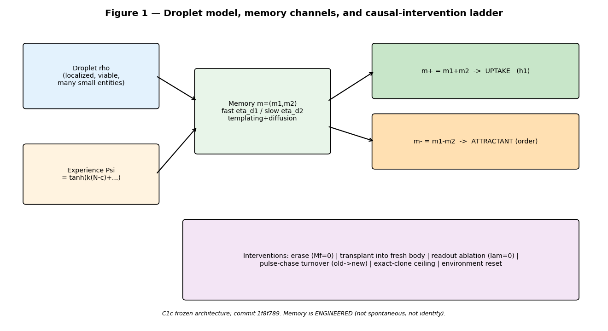
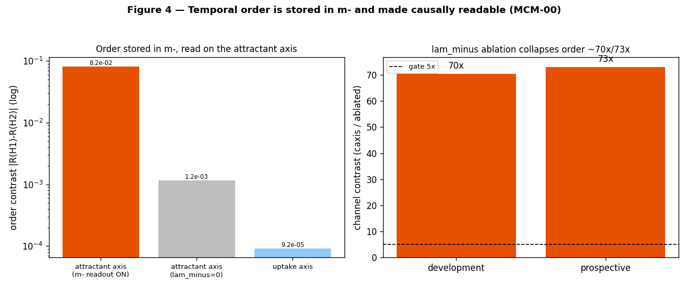
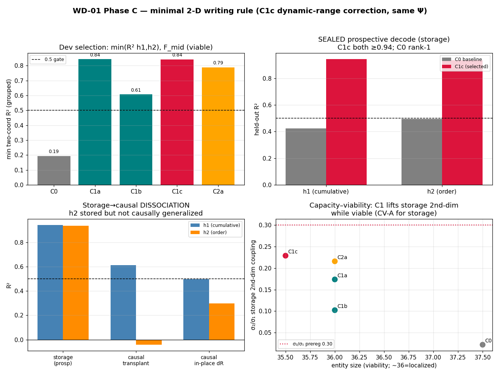
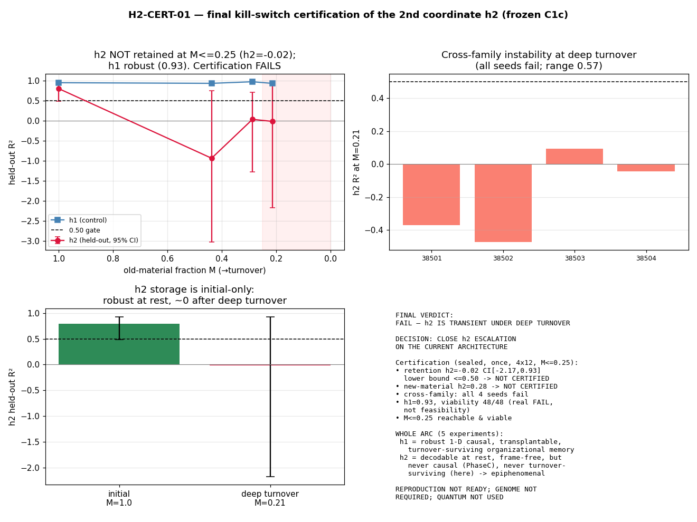
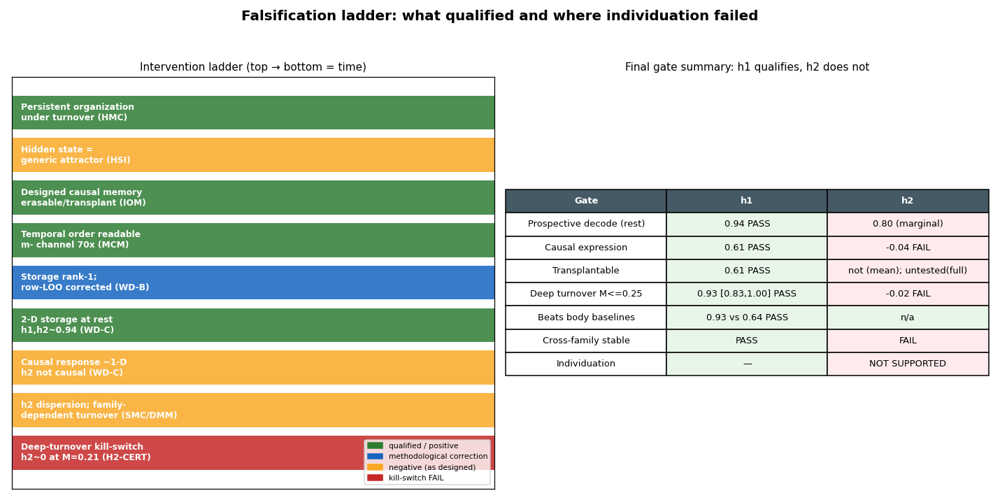

# Abstract
Biological individuals persist while their constituent material is replaced. We ask a deflationary, testable
version of this question in a simulated reaction-transport droplet: can an internal state encode the droplet's
experience in a way that is causal, transplantable, and robust to constituent turnover — and does such memory
individuate droplets? Using a droplet with a designed two-component intensive memory field coupled to nutrient
uptake ($m_+$) and attractant production ($m_-$), we run a preregistered ladder of interventions with grouped,
prospective, kill-switched evaluation and continuity-safe entity tracking. **Central result:** under a globally
imposed nutrient history, multiple persistent droplets locally encode a similar engineered cumulative-experience
coordinate ($h_1$); a continuously tracked droplet retains this internal causal state during substantial
constituent turnover (longitudinal holdout on untouched seeds: $h_1$ held-out $R^2=0.98$, 95% CI $[0.97,1.00]$
at old-material fraction $M\approx0.19$, with 36/36 track survival). $h_1$ is causally expressed through uptake
and transplantable into a fresh standardized body ($R^2=0.61$), and exceeds body-size/mass baselines after
turnover. Crucially, $h_1$ is *global* in informational content — decodable from essentially any large droplet
— so it does **not** individuate droplets. A second candidate coordinate ($h_2$; temporal order / value
dispersion) is decodable at rest but fails to qualify: causal response $\approx$1-D, and deep-turnover held-out
$R^2=0.34$ ($<0.50$) under continuity-safe tracking. Methodologically, we show that high internal variation,
decodability, rest-state causal expression, and largest-component visual continuity each fail to imply a
turnover-surviving, individuating causal memory, and that a largest-component *reselection* tracker produces
spurious continuity that a longitudinal tracker removes. We claim no life, agency, identity, individuation,
reproduction, or heredity.

# 1. Introduction
Persistence of *organization* rather than of *matter* is a candidate substrate for biological memory and
identity [7, 8]. A droplet whose molecules turn over but whose organization endures might
carry a history of its experience. We make this precise and falsifiable. A history variable being *decodable*
from a system is insufficient evidence of memory: a decoder may exploit residual environment, current body
size, laboratory-frame position, or the mere fact that a globally imposed history is written into every entity.
A memory worth the name must (i) be causal — it must shape dynamics [9]; (ii) be separable from the
current body and environment, e.g. survive transplantation into a standardized body; and (iii) survive
substantial replacement of the constituent material. Individuation — making one droplet distinguishable from
another by its history — requires strictly more than persistence and is not claimed here.

# 2. Related work
Our droplet is a dissipative, pattern-forming reaction-transport system in the tradition of reaction-diffusion
morphogenesis [1, 5, 6], with excitable local chemistry of FitzHugh–Nagumo type
[2, 3]. The memory field is an engineered attractor-like internal state; distributed
attractor memories are classical [4]. Unlike associative-memory networks, our aim is not storage
capacity but the *causal and material* status of a history coordinate under turnover, evaluated with the
prospective, preregistered, kill-switched discipline now standard in empirical model evaluation.

# 3. Model
The substrate is a periodic $64\times64$ lattice ($dt=0.1$) carrying a density field $\rho$, internal
excitable chemistry $(U,V)$, nutrient $N$, and attractant $c$, with advective transport toward $c$, bounded
growth, and death. On top of the frozen scaffold we add a bounded intensive memory $m=(m_1,m_2)$ (extensive
$M_f=\rho\, m$), written by a local experience signal and read through two existing physical channels.

**Write.** The experience signal is $\Psi=\tanh\!\big(k_{\exp}(N-c)+k_{up}(\text{uptake}-\overline{\text{uptake}})\big)$.
Each component is a leaky integrator of $\Psi$ with its own time constant, plus local templating and diffusion:
$$\dot m_k = \eta_w\,\Psi - \eta_{d,k}\,m_k + \eta_t\big(\langle m_k\rangle_{\text{nbr}}-m_k\big) + D_m\,\nabla^2 m_k,\qquad m_k\in[-1,1].$$
New mass created by growth inherits the local intensive memory ($M_f \mathrel{+}= g\,m$); death scales all
fields uniformly. **Read.** $m_+=m_1+m_2$ modulates nutrient uptake ($\text{uptake}\!\to\!\text{uptake}\,(1+\lambda_+\tanh m_+)$)
and $m_-=m_1-m_2$ modulates attractant production ($\propto 1+\lambda_-\tanh m_-$). With $\lambda_-=0$ the model
reduces bit-identically to the single-channel predecessor; with all coupling zero it reduces to the frozen
scaffold. **History coordinates.** Two-phase *global* nutrient histories ($N\mathrel{+}=a$ during each phase)
define $h_1=a_{\text{early}}+a_{\text{late}}$ (cumulative) and $h_2=a_{\text{late}}-a_{\text{early}}$ (order).

**Table 1 — Frozen C1c parameters.**

| symbol | value | meaning |
|---|---|---|
| $\eta_w$ | 0.015 | experience write gain |
| $\eta_{d,1},\eta_{d,2}$ | 0.35, 0.006 | fast / slow forgetting |
| $\eta_t$ | 0.010 | local templating (4-neighbour) |
| $D_m$ | 0.010 | memory diffusion |
| $k_{\exp},k_{up}$ | 1.0, 1.0 | experience-signal gains |
| $\lambda_+,\lambda_-$ | 0.25, 0.15 | uptake / attractant coupling |
| grid, $dt$ | $64^2$, 0.1 | lattice, timestep |

# 4. Methods
**Protocol.** Warm a body (2000 steps), erase memory, apply the two-phase history ($T=60$ each), settle 20
steps, then relabel all material "old" (cohort 0) and evolve forward; new growth is cohort 1. The old-material
fraction $M$ is the old cohort's mass share of the tracked entity; the pulse-chase tracer is passive and never
enters the dynamics.
**Entity detection and tracking.** The substrate self-organises into many small droplets. Connected components
are detected periodically (wrapped labelling; circular centroids); feature extraction is translation-invariant
(verified: whole-world shifts, including boundary-straddling, leave size and memory statistics bit-invariant).
Historical analyses selected the *largest* component — but this is *reselected* each checkpoint (§5.9); we add a
frozen **longitudinal tracker** (initialise once; match by periodic maximum mask-overlap; censor on loss;
never uses $h_1$, $h_2$, $M$, or labels) and re-certify all turnover claims longitudinally.
**Decoding and statistics.** Grouped leave-history-out ridge regression (rows sharing a history stay in one
fold; no row-wise leave-one-out); development and prospective families separated; sealed families hashed before
selection and executed once; donor-level bootstrap 95% CIs; constant, shuffled-history, and trivial-feature
nulls.

# 5. Results
**5.1 Persistent organization; hidden state is a generic attractor.** The droplet remains localized and viable
under turnover; a hidden internal state exists but behaves as a generic causal attractor, not a
history-specific identity (individuation AUC $\approx0.3$–$0.4$).
**5.2 An engineered causal memory $h_1$.** The two-component field is causal and erasable (ablating coupling
removes the effect exactly), transplantable, and turnover-related.
**5.3 Temporal order made readable.** A second orthogonal read-out ($m_-\!\to$ attractant) makes matched-dose
temporal order causally readable; the order contrast collapses $\sim$70$\times$/73$\times$ (dev/prospective)
under $\lambda_-$ ablation and is absent on the uptake axis (Fig 4).
**5.4 Apparent dimensionality corrected.** The original "high-dimensional" continuous-history claim was an
artefact of a 20–47$\times$ history-amplitude mismatch and a replicate-leaking row-wise cross-validation;
grouped evaluation reduces the headline $R^2$ from 0.57 to 0.19; three estimators agree the frozen writing is
rank $\approx$1 (Fig 5).
**5.5 Two-coordinate storage at rest.** A minimal de-saturating writing change (C1c) yields two prospectively
decodable coordinates at rest ($h_1,h_2\approx0.94$); the rank ratio is $0.283$, marginally below the
preregistered 0.30.
**5.6 Causal-response collapse.** Despite 2-D storage, the causal response is $\approx$1-D: $h_1$ is causally
expressed (transplant 0.61, in-place 0.50) but $h_2$ is not ($-0.04$/0.30) (Fig 5).
**5.7–5.8 $h_2$ is a frame-free dispersion; deep-turnover kill-switch.** $h_2$ is carried by a frame-free
value-dispersion statistic (lab-frame decoder collapses under translation), with family-dependent turnover
behaviour; on a sealed family executed once, held-out $h_2\approx0$ at $M\approx0.21$ (Fig 6).
**5.9 Tracker-continuity audit (Fig 7 correction).** Human inspection of the viewer exposed the tracked-entity
overlay teleporting between blobs. An event audit found the selection rule ($\arg\max$ size, reselected each
frame) switches entities 5 times on the incident seed, with $M$ and $\text{std}(m_-)$ discontinuities at those
frames. Detection is periodic-safe, so this is *reselection*, not a wrap artefact. A frozen longitudinal
tracker on **untouched** seeds 38502–38504 eliminates switching (0 switches, 36/36 survival) and re-certifies
$h_1$: init 0.92 $[0.86,0.99]$; deep 0.98 $[0.97,1.00]$ at $M\approx0.19$; $h_2$ stays 0.34 ($<0.50$).
$h_1$ decodes $\approx$equally from largest/2nd-largest/longitudinal (0.96/0.98/0.99) because $h_1$ is *global*.
**5.10 Surviving result.** $h_1$ is a one-dimensional, global, causal, transplantable memory of cumulative
experience, retained by a continuously tracked droplet through substantial turnover; it does not individuate
droplets.

# 6. Discussion
The ladder separates concepts usually conflated: memory vs decodability; storage vs causal expression; passive
local copying vs active reconstruction; material replacement vs organizational inheritance; and
visual/size-reselected continuity vs longitudinal continuity. $h_1$ storage and causal expression are *local*,
but its informational content is *global*, so it does not individuate. Individuation would additionally require
multiple independent, causal, transplantable, turnover-surviving coordinates and distinct histories carried by
different droplets in one world — none demonstrated. The tracker incident, handled transparently, converts a
loose "the entity survived turnover" into a certified "a continuously tracked droplet retains a global
cumulative coordinate through turnover, which does not individuate."

# 7. Limitations
Engineered (not emergent) memory; simulator-specific dynamics; small entities ($\sim$30–55 cells); designed
two-phase *global* histories; low-dimensional, global, non-individuating $h_1$; explicit local memory copying
during growth; historical analyses used largest-component reselection (corrected here); mean-field transplant
read-out; no reproduction; no active reconstruction; no individuation; substrate-general capacity untested.

# 8. Conclusion
Under a globally imposed history, persistent droplets locally encode a similar engineered one-dimensional
cumulative causal memory; a continuously tracked droplet retains this internal causal state through substantial
material turnover. It does not individuate droplets, and a second decodable coordinate did not qualify as an
independent, causal, turnover-surviving dimension. Individuation, reproduction, and a genome are not warranted
by the evidence.

# Data and code availability
All code, frozen configurations, sealed manifests (SHA-256), raw data, analysis scripts, and figure generators
are in the repository under isolated branches (see Reproducibility appendix and docs/paper/REPRODUCIBILITY.md).
No data were withheld; negative results and corrections are retained.

# Reproducibility statement
Physics is frozen (engine blob 7c91b91; C1c parameters in Table 1). Sealed prospective families were hashed
before selection and executed once. Grouped leave-history-out decoding avoids replicate leakage. The
longitudinal tracker is frozen and specified in docs/audit/TCA_01_TRACKER_SPEC.md. Reproduction commands are in
the Reproducibility appendix.

# References

1. A. M. Turing (1952). The chemical basis of morphogenesis. Phil. Trans. R. Soc. Lond. B 237(641):37-72.

2. R. FitzHugh (1961). Impulses and physiological states in theoretical models of nerve membrane. Biophysical Journal 1(6):445-466.

3. J. Nagumo, S. Arimoto, S. Yoshizawa (1962). An active pulse transmission line simulating nerve axon. Proc. IRE 50(10):2061-2070.

4. J. J. Hopfield (1982). Neural networks and physical systems with emergent collective computational abilities. PNAS 79(8):2554-2558.

5. M. C. Cross, P. C. Hohenberg (1993). Pattern formation outside of equilibrium. Rev. Mod. Phys. 65(3):851-1112.

6. G. Nicolis, I. Prigogine (1977). Self-Organization in Nonequilibrium Systems. Wiley.

7. H. R. Maturana, F. J. Varela (1980). Autopoiesis and Cognition: The Realization of the Living. D. Reidel.

8. W. R. Ashby (1952). Design for a Brain. Chapman & Hall.

9. J. Pearl (2009). Causality: Models, Reasoning, and Inference, 2nd ed. Cambridge University Press.
