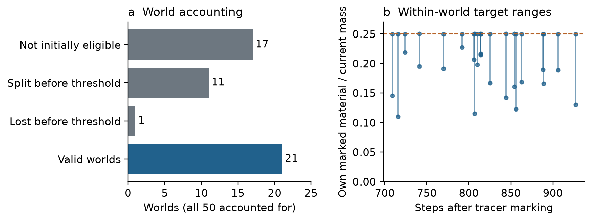
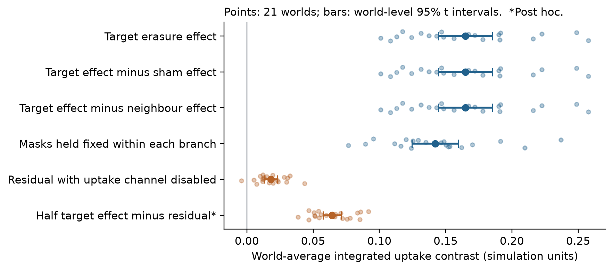
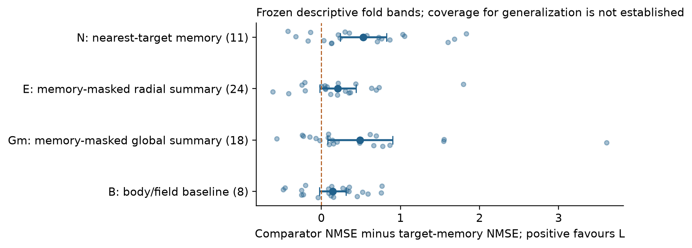

# Testing causal memory expression and local predictive advantage after material turnover

Tommy Lepesteur

Research article | 5 September 2026 | Author review version

## Abstract

A history-dependent state can affect a system's future without its local representation being demonstrably superior to information available elsewhere. We examine these two questions in a spatial model whose intensive memory fields are copied during material growth and directly modulate nutrient uptake. A prospectively fixed experiment generated 50 worlds, of which 21 satisfied the target-selection, tracking and turnover requirements. In these worlds, material carrying each target's own initial-mask label contributed at most one quarter of its current mass. Erasing target memory reduced subsequent integrated uptake by 0.1648 simulation units (world-level 95% t interval [0.1443, 0.1854]); the effect was positive in every retained world, exceeded sham and neighbour-erasure effects, and was attenuated when the uptake readout channel was disabled. A frozen decoder recovered assigned nutrient-history amplitude from target-memory summaries, but the prespecified requirement to outperform every competing access scope was unmet: comparisons with a memory-masked radial summary and a body/field baseline had descriptive fold bands spanning zero. These overlapping-training-fold bands and a within-world permutation diagnostic do not establish calibrated generalization uncertainty or randomized history causality. The result supports causal expression of the manipulated field after a specified decline in own-marked material, conditional on admissibility. It does not establish that local informational ownership is absent. Exact-byte inputs, independent recomputations, analytic copying identities and sensitivity analyses make this a reproducible computational assay case study of the boundary between causal function and a stronger operational claim about local predictive access.

## 1. Introduction

Material components can be replaced while a system continues to express a history-dependent state. This possibility is not, by itself, a new principle of memory. Lisman's theoretical model explicitly addressed stable memory despite molecular turnover [1], and engineered genetic toggles demonstrate how feedback can support persistent state in another substrate [2]. What requires a separate test is the evidential connection between a retained state, its causal influence on a chosen output, and a claim that a particular local representation has a privileged relationship to that history.

These questions also matter when interpreting simulated structures. Spatial localization supplies a tractable measurement region, but it need not define an individual. Information-theoretic treatments distinguish several possible relationships between a system, its environment and its future [3]. An intervention-based account of semantic information additionally asks which correlations matter for an explicit viability objective [4]. Neither framework is equivalent to observing a connected component, decoding a label, or changing an uptake variable by intervention. Active-droplet studies [5], localized-rule models of artificial life [6], and recent analyses of distributed causal ancestry [7] further illustrate that persistence, growth, lineage and spatial connectedness are different constructs.

Here we study a deliberately narrower question. In a model with local history-writing and material copying, does the represented state remain causally expressed once the target contains little material from its own marked snapshot, and does its local memory summary satisfy a fixed predictive-superiority requirement against competing summaries? We call the latter a test of **local predictive advantage**. The historical protocol used the term **local informational ownership** for its conjunction of decoding, access-comparison and causal gates. We retain that term only when discussing the operational claim, not as a general definition of biological ownership or individuality.

The experiment is useful because the relevant evidence can be positive in one respect and insufficient in another. We report a reproducible causal erasure effect alongside an unmet access-comparison requirement. We do not infer an absence of local ownership from that failure. The main contribution is the joint, prospectively specified assay and its released conditional result, supplemented by a source-level explanation of why persistence is plausible under the implemented copying law. This explanation places a limit on mechanistic novelty: the assay does not distinguish active restoration from passive copying and ordinary field dynamics.

## 2. Methods

### 2.1. Spatial dynamics and an analytic copying reference

The simulation uses a periodic 64 × 64 lattice, unit cell spacing and time step 0.1. Density ρ is transported by a density-limited chemotactic face flux with diffusion. Nutrient N and attractant c are separate fields. Two internal concentrations, u = U/ρ and v = V/ρ, undergo symmetric mutual inhibition. They are not a FitzHugh–Nagumo system. Two bounded memory concentrations, m₁ and m₂, are stored as extensive fields Mᶠₖ = ρmₖ. Their update includes a shared experience signal, different forgetting rates and spatial smoothing. The Supplement gives the actual split-step order, coefficients and source locations; those discrete operations, including clipping, define the model.

During one update, nutrient consumption g is proportional to the available nutrient and density, a crowding factor, an internal-state factor, and the designed memory readout 1 + λ₊tanh(m₁ + m₂), subject to clipping by available nutrient. The intact coefficient is λ₊ = 0.25. A second channel with λ₋ = 0.15 modulates attractant production through tanh(m₁ − m₂). Thus an erasure effect on uptake is physically meaningful within the simulation but is not an unexpected discovery of an emergent readout mechanism.

The growth operation adds g to density and gmₖ to extensive memory. Uniform removal multiplies both by the same positive factor q. Consequently, considered alone, these operations obey

> Growth copying: (ρmₖ + gmₖ)/(ρ + g) = mₖ.
>
> Uniform removal: (qρmₖ)/(qρ) = mₖ.

These identities show why replacing constituents need not dilute an intensive state. They do not predict the complete trajectory, which also includes transport, writing, forgetting and clipping. Moreover, the four-neighbour averaging term called “templating” in the source is exactly one quarter of the discrete Laplacian. Together with explicit memory diffusion it produces an effective smoothing coefficient of 0.0125. It is not an independently specified mechanism that restores a stored pattern after corruption.

### 2.2. Prospectively specified worlds, histories and material marking

The protocol sequence is summarized in Supplementary Figure S2. The frozen primary family comprised seeds 54001–54050. All 50 worlds were executed. A predeclared reserve could be activated on feasibility counts alone if fewer than 18 worlds were valid; no reserve world was needed or run. A seal and execution authorization precede the result commit in the recovered Git history. We verified these bindings and the persisted raw records; this is documentary evidence of the recorded order, not proof that an unrecorded execution could never have occurred.

After 800 warm-up steps, the algorithm selected three components of at least 45 cells, separated by at least 24 cells. Each target received two local Gaussian nutrient drives of 60 steps each, followed by 120 steps of settling. The two phase amplitudes lay in [0.005, 0.035]. The history label y was their sum, not measured nutrient uptake or the full spatially integrated dose. The initialization and amplitude-generation code restart the pseudorandom generator with the same world seed. They therefore do not constitute independently randomized assignment streams; this matters for the interpretation of label permutation below.

At the post-history snapshot, passive tracers marked the material within each target mask. For target i, Mᵢ denotes the mass currently carrying its own initial-mask label divided by its current mass. Neutral evolution continued, with memory writing active, until all three continuously admissible targets satisfied Mᵢ ≤ 0.25 or the 1500-step cap was reached. A bijective overlap tracker censored split, merge, lost or ambiguous tracks; the largest component also had to occupy less than 15% of the grid. No daughter was substituted after a censoring event.

This threshold concerns **own-marked material**. Material initially outside the marked masks is not distinguished from newly supplied material by the complementary unmarked fraction. The experiment therefore does not show that 75% of the target was newly synthesized, that all old material disappeared, or that the remaining marked material was causally irrelevant.

### 2.3. Counterfactual erasure and readout controls

At the deep snapshot, deterministic branches began from the same state. The target-erasure intervention set both extensive memory fields to zero in one target's current mask. Other branches retained memory, erased a distant low-density sham patch, erased each of the other two targets, or disabled the uptake channel by setting λ₊ = 0 while retaining λ₋ = 0.15. The latter control differs from the separately recorded full readout ablation.

Every assay reset nutrient uniformly to N₀ = 1, evolved for 40 settling steps, added a uniform nutrient increment of 0.25 for five steps, and integrated uptake for 40 steps from probe onset. This is nutrient standardization; it is not a test of survival through natural nutrient washout. The primary output follows each target through the bijective tracker. A second output integrates on masks fixed during the probe. Those masks are selected separately in each branch after erasure and settling. This control removes temporal tracking during the probe but does not impose an identical observation region across interventions.

For each target, the own effect is intact uptake minus uptake after its own memory is erased. The neighbour effect is the average change caused by erasing either other target. The sham effect is the change after sham erasure. We average the three target contrasts within each original world before inference. Thus 63 targets provide 21 world-level observations, not 63 independent replicates.

The frozen causal gate required positive own, own-minus-sham and own-minus-neighbour lower t bounds; a residual effect under uptake-channel ablation with upper bound below half the intact mean effect; positive fixed-within-branch direction; and at least 18 valid worlds. Validity formally requires acceptable geometry in the intact, sham and individual-erasure branches at both the post-history and deep assays. The estimand is therefore conditional on jointly valid trajectories. In the observed family, all worlds that reached the deep threshold passed the assay requirements.

### 2.4. Access scopes and frozen prediction rule

At the deep snapshot, the fixed target-memory representation L contains 11 summary statistics of m₁ and m₂. Four comparator scopes enter the primary conjunction: nearest-target memory N (11 features), a target-centred radial field summary E (24), a global field summary Gm (18), and a body/field baseline B (8). E and Gm zero **only the target's memory fields** before aggregation. They retain density, internal state, nutrient, attractant and uptake within the target. They are not observations exclusively outside the target body. Two additional scopes, all three memory summaries P and the exact concatenation L ⊕ Gm, are diagnostic only.

Each scope predicts y using ridge regression with penalty 1. Outer validation leaves out one complete original world, including its three targets. Centering and scaling use training worlds only. For held-out world w, the mean squared prediction error over its three targets is divided by the training-label variance. The intercept-only training mean supplies a common baseline. Positive skill is baseline normalized error minus scope normalized error. Positive L advantage over scope S is error(S) minus error(L).

The frozen local-exclusion gate required a positive lower band for L's own skill and the lower bound of every paired L-advantage band to exceed zero. The historical analysis formed t bands from the fixed per-world cross-validation losses. We reproduce these as **descriptive fold bands**: overlapping training sets induce dependence, so the usual independent-observation calculation does not establish their nominal coverage for generalization error. This is a general cross-validation uncertainty issue [8]; the exact magnitude or direction of miscoverage in this dataset is not known. We do not use the bands as calibrated confidence intervals demonstrating superiority or equivalence.

The frozen own-history diagnostic used 1000 within-world permutations and a plus-one Monte Carlo probability. Its null requires the relevant conditional exchangeability of target labels. That assumption is not guaranteed by the generation code, target ordering or validity selection. Accordingly, the permutation result is a reproducible label-shuffling diagnostic, not an exact randomized test proving a causal effect of nutrient history.

### 2.5. Reconstruction and additional analyses

The primary estimands, representations, seeds and decision tree were fixed before the recorded primary execution. The present paper reconstructs these results from hash-verified JSON; it adds no new simulated worlds. The historical raw-only cross-check is replayed transparently. A separate augmented least-squares implementation recomputes the prediction losses and causal contrasts. A further independent implementation verifies predictions, label shuffling and analytic leakage checks.

Post hoc analyses comprise world-level sign checks, a paired attenuation contrast 0.5 × own effect − ablation residual, and deletion of each world with complete refitting of all remaining cross-validation models. The latter is an influence diagnostic, not a new confirmatory gate or a calibrated substitute interval. Supplementary tables retain the predictions, losses, excluded-world reasons and all reported sensitivity settings.

## 3. Results

### 3.1. The tested population is a selected subset of generated worlds

Of 50 worlds, 17 lacked three initially eligible targets. 11 further worlds encountered a split and 1 a lost track before reaching the turnover threshold. The remaining 21 worlds reached the threshold and passed both assay requirements. No additional deep-reaching world was excluded by assay geometry. Figure 1 accounts for all generated worlds.

Across the 63 retained targets, own-marked material fractions ranged from 0.1104 to 0.2500 (rounded), all at or below the specified threshold. Deep snapshots occurred 709–927 steps after marking. These observations demonstrate the specified change in material composition in admissible targets, not complete replacement of all material or continuity of an independently established identity.

*Figure 1. Population accounting and the operational turnover condition. Panel a counts every primary world. Panel b shows the minimum and maximum own-marked material fraction among the three targets in each retained world at its first eligible deep snapshot. The horizontal line is the prespecified 0.25 threshold. The unmarked remainder is not exclusively newly synthesized material.*

### 3.2. Erasing the represented state changes subsequent uptake

The own-erasure effect was 0.1648 integrated uptake units, with a world-level 95% t interval of [0.1443, 0.1854]. Mean intact uptake was 3.0081 units. The mean fractional reduction, calculated for each target and then averaged within and across worlds, was 5.57%; world means ranged from 3.92% to 6.97%. The absolute effect was positive in every retained world. The own-minus-sham and own-minus-neighbour contrasts were also positive, with means 0.1648 and 0.1648 respectively (Figure 2). These branch comparisons support a causal effect of intervening on the represented target field, within the selected population and standardized assay. Together with decoding, they do not establish that the causal component of the field specifically mediates the assigned history; erasure also removes any non-history-specific component.

The effect remained positive when observation masks were held fixed during each branch's probe: 0.1422, interval [0.1246, 0.1597]. This convergent direction does not eliminate region-selection differences between branches. Under uptake-channel ablation, the residual own-erasure effect was 0.0181, interval [0.0132, 0.0231]. The residual was nonzero, consistent with the retained attractant channel and coupled dynamics. The frozen causal gate passed.

An additional paired check gives 0.5 × own effect − residual = 0.0643, interval [0.0574, 0.0711], positive in all retained worlds. This post hoc comparison supports attenuation below half the intact effect without treating the estimated intact mean as a fixed denominator. The descriptive reduction in the ratio of mean effects was 89.0%. None of these comparisons identifies copying, ongoing writing or an error-correcting mechanism as the unique cause of the retained field.

*Figure 2. Counterfactual uptake contrasts at the deep snapshot. Faint points are world means over three targets; filled points and bars are means and world-level t intervals. The fixed-mask control fixes masks within a branch, not across branches. The final row is a post hoc paired attenuation contrast. Uptake is measured in the simulator's integrated nutrient-consumption units.*

### 3.3. The stronger access-comparison requirement was not met

The target-memory decoder's mean normalized skill was 0.3954. No shuffled-label replicate reached the observed mean in the frozen 1000-replicate diagnostic, giving a plus-one probability of 1/1001. This confirms the numerical history-prediction result under the specified procedure; its causal and inferential qualifications are those given in Methods.

All four L-advantage point estimates were positive (Table 1). However, the descriptive fold bands for E and B included zero. The frozen local-exclusion conjunction therefore failed. The result is compatible with a true advantage of L over these comparators, as well as with weaker or absent advantages. It neither establishes equivalence nor demonstrates that local information is absent or owned by the environment.

| Comparator | Mean L advantage | Frozen descriptive fold band |
|---|---:|---:|
| N: nearest-target memory | 0.5304 | [0.2363, 0.8245] |
| E: memory-masked radial fields | 0.2072 | [-0.0221, 0.4364] |
| Gm: memory-masked global fields | 0.4895 | [0.0797, 0.8993] |
| B: body/field baseline | 0.1446 | [-0.0226, 0.3118] |

*Table 1. Error of the comparator minus error of L, normalized within each held-out world by its training-label variance. Positive values favour L. Bands reproduce the frozen arithmetic and have unestablished coverage for cross-validation generalization error; they should not be read as equivalence tests.*

*Figure 3. The access comparisons underlying the unmet conjunction. Individual held-world loss differences show the dispersion hidden by the average. Neither a comparator's inclusion of zero nor failure of the conjunction proves absence of local ownership. Feature counts are given in parentheses; representation and regularization affect these comparisons.*

The historical executable selected outcome code B. Its archived short label, “causal effect without ownership,” is stronger than the data justify. Our interpretation is **causal effect with local ownership not established by the specified test**. The separate frozen environmental-explanation conjunction also failed; the data do not establish a competing positive claim of environmental ownership.

### 3.4. Influence and numerical reproducibility

With complete refitting after deleting one original world, E and B each crossed the historical lower-band threshold in 5 and 5 of the 21 deletions, respectively. Gm lost its original threshold passage in 3 deletions. These exploratory checks show that the gate pattern is sensitive to a small number of worlds and to refitted prediction models. They strengthen the case for reporting the unmet conjunction as limited evidence rather than converting it into an ontological negative.

All 222 packaged input files passed byte and hash checks. The additional primary reconstruction agreed with the historical raw-only implementation to a maximum absolute difference of 1.17e-15 for checked causal summaries and access bands. The independent prediction implementation also reproduced the permutation result. These are independent calculations on the same observations. They are not replications on new seeds or external validation of the simulator's scientific constructs.

## 4. Discussion

The experiment supplies two distinct pieces of evidence. First, intervening on a target's represented field changes subsequent uptake even after its own marked material fraction has fallen below a fixed threshold. Second, the available sample and frozen representations do not establish the complete local predictive-superiority conjunction. Reporting the second result does not diminish the first; it specifies what the first cannot decide.

The analytic copying reference is central to interpretation. Growth replaces material while assigning it the local intensive state by construction. Uniform removal likewise leaves the state-to-mass ratio unchanged. These operations make persistence plausible without an identity-preserving repair mechanism. The additional spatial term is smoothing, and uptake reads the memory field directly. The measured control battery therefore establishes the expression of a designed causal channel in a nontrivial evolving geometry, rather than a new mechanism for autonomous memory maintenance.

The access gate addresses another issue. A local variable can be predictive even when a coarse body or environmental summary also carries related information. Conversely, a comparator may perform poorly because its representation or regression model is inadequate. Redundancy, nonlinear coding and synergistic information are not identified by these ridge comparisons. The present scores do not compute the informational partitions of Krakauer and colleagues [3], nor the viability-linked semantic information of Kolchinsky and Wolpert [4]. Even a successful local-exclusion gate would remain a result about specified access classes and estimators, not a universal test of individuality.

Our result is deliberately conditional. The world-level exclusion rule prevents treating surviving targets within an invalid world as independent successes, but it also selects a restricted geometric population. 17 worlds were initially ineligible and 12 lost continuous tracking before the turnover criterion. Effects in these worlds were not measured under the same valid assay. Their missing outcomes cannot be assigned zero or extrapolated from the retained mean. Formal assay validity also depends on post-intervention geometry, although it produced no further exclusions among deep-reaching worlds here.

Several limitations constrain stronger conclusions. The material tracer leaves initially unmarked matter unresolved and never establishes complete turnover. Memory writing remains active during the neutral interval. Erasure changes both memory channels at once; nutrient reset removes one environmental difference by intervention but does not standardize all other fields. Masks chosen after branch-specific relaxation permit region-selection differences. The history assignment shares a pseudorandom seed stream with initialization, so the label-shuffling diagnostic has no demonstrated exact randomization interpretation. The cross-validation bands reuse overlapping training data, while only 21 original worlds inform uncertainty. No prospective equivalence margin was specified, and no targeted restoration or transplant experiment distinguishes competing maintenance mechanisms.

These limitations leave a useful methodological result. A complete evidence chain can preserve a positive causal finding while declining a stronger ownership claim. This is particularly relevant to artificial-life systems in which the model itself embeds transport, copying and readout choices. Physical models of active droplets [5], locally parameterized cellular systems [6] and distributed replication systems [7] should not be pooled into this sample or used to supply missing criteria. Their different mechanisms help identify what an experiment must measure before transferring a claim across substrates.

The current evidence supports a focused computational assay case study. A future extension would need to make its target estimand explicit: a more accurately estimated local predictive advantage, causal information transfer under interventions on competing storage sites, or maintenance after perturbation with passive copying and ongoing writing controlled. Those are different experiments. None is retroactively supplied by the present erasure effect or by the failure of its access gate.

## Data and code availability

The accompanying package includes all 50 raw JSON records, frozen protocol and execution bindings, an exact-byte model-source capsule, analysis scripts, per-world tables, figures and the Supplement. `scripts/reproduce.py` verifies inputs and rebuilds the analysis and documents without running the simulator. The repository is https://github.com/Mythmaker28/emergent-dynamics-lab, development PR 35. Source revisions, hashes, environment records and the distinction between same-data reconstruction and new execution are given in `DATA_PROVENANCE.md` and `REPRODUCIBILITY_AUDIT.md`. No archival DOI or journal publication is claimed for this author-review package.

## Author and computational assistance statement

The author is responsible for the scientific claims and any submission decision. Coding, drafting, source inspection and adversarial checks were assisted by language-model agents. Their reviews are documented, distinguishable calculations within the same workflow; they are not independent human peer review. The original simulation was not rerun during preparation of this article.

## References

[1] John E. Lisman. A mechanism for memory storage insensitive to molecular turnover: a bistable autophosphorylating kinase. Proceedings of the National Academy of Sciences 82: 3055-3057, 1985. https://doi.org/10.1073/pnas.82.9.3055

[2] Timothy S. Gardner, Charles R. Cantor, James J. Collins. Construction of a genetic toggle switch in Escherichia coli. Nature 403: 339-342, 2000. https://doi.org/10.1038/35002131

[3] David Krakauer, Nils Bertschinger, Eckehard Olbrich, Jessica C. Flack, Nihat Ay. The information theory of individuality. Theory in Biosciences 139: 209-223, 2020. https://doi.org/10.1007/s12064-020-00313-7

[4] Artemy Kolchinsky, David H. Wolpert. Semantic information, autonomous agency and non-equilibrium statistical physics. Interface Focus 8: 20180041, 2018. https://doi.org/10.1098/rsfs.2018.0041

[5] David Zwicker, Rabea Seyboldt, Christoph A. Weber, Anthony A. Hyman, Frank Juelicher. Growth and division of active droplets provides a model for protocells. Nature Physics 13: 408-413, 2017. https://doi.org/10.1038/nphys3984

[6] Erwan Plantec, Gautier Hamon, Mayalen Etcheverry, Bert Wang-Chak Chan, Pierre-Yves Oudeyer, Clement Moulin-Frier. Flow-Lenia: Emergent Evolutionary Dynamics in Mass Conservative Continuous Cellular Automata. Artificial Life 31: 228-248, 2025. https://doi.org/10.1162/artl_a_00471

[7] Arend Hintze, Clifford Bohm. Rethinking self-replication: detecting distributed selfhood in the outlier cellular automaton. npj Complexity 3: 11, 2026. https://doi.org/10.1038/s44260-026-00074-2

[8] Yoshua Bengio, Yves Grandvalet. No Unbiased Estimator of the Variance of K-Fold Cross-Validation. Journal of Machine Learning Research 5: 1089-1105, 2004. https://www.jmlr.org/papers/v5/grandvalet04a.html
