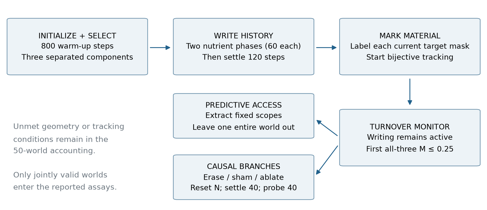
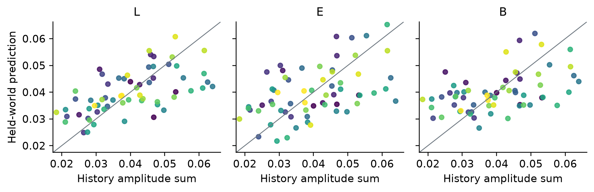

# Supplement: testing causal memory expression and local predictive advantage after material turnover

Tommy Lepesteur | Supplement to the author review version of 5 September 2026

## S1. Scope, design status and reconstruction

This Supplement specifies the computational experiment underlying the main article. Primary seeds, material criterion, access scopes, regression penalty, permutation procedure and outcome conjunction were frozen before the recorded primary execution. The present analyses reconstruct existing observations; no simulated world was generated for this manuscript. World-level sign checks, paired attenuation inference and full-refit deletion sensitivity are explicitly post hoc. They do not replace the historical decision tree.

The primary source record is the 50-file family `LCI-TURNOVER-PROSPECTIVE-03G`. The paper's copied documentation may retain preparation-time strings such as “not sealed” inside frozen protocol files. Later seal, authorization, execution and result artifacts supply the status transitions. A preparation-time string is not edited to create retrospective consistency. The manifest and provenance record identify which artifact supports each transition.

Frozen source histories also contain overstrong interpretive labels. In particular, executable outcome B is preserved for exact comparison, but the article interprets it as a causal effect with the local ownership criterion unmet. No archived label overrides the reported numerical evidence.

## S2. Exact update scheme

### S2.1. State and transport

The lattice is periodic with size 64, unit spacing and time step Δt = 0.1. State variables are density ρ, extensive internal fields U = ρu and V = ρv, attractant c, nutrient N, extensive memory Mᶠ₁ and Mᶠ₂, passive material cohorts C, and the per-update uptake g. The numerical floor is ε = 10⁻¹². The discrete Laplacian is the sum over four axial neighbours minus four times the centre.

For the face from cell x to x + e, let Δc = c(x + e) − c(x). The chemotactic donor and receiver densities are selected according to the sign of Δc. The source computes

> χ_face = χ₀ / {1 + [(c(x) + c(x + e))/(2c_sat)]²}
>
> J = χ_face Δc ρ_up max(0, 1 − ρ_down/ρ_max) − Dρ[ρ(x + e) − ρ(x)].

Density receives −Δt times the discrete divergence of J. Every extensive field follows the same total signed face flux multiplied by its donor concentration. Donor choice for those fields uses the sign of total J. These are finite-volume-style discrete operations; substituting a continuum differential equation would not specify the same implementation.

### S2.2. Growth, removal and internal fields

After transport, the source calculates σ = (u − v)/(u + v + ε) and m⁺ = tanh(m₁ + m₂). Nutrient consumption during the update is

> g = clip[Δt g₀ρN max(0, 1 − ρ/ρ_max)(1 + βσ)(1 + λ₊m⁺), 0, max(N, 0)].

It then applies N ← N − g; ρ ← ρ + g; U ← U + gu; V ← V + gv; Mᶠₖ ← Mᶠₖ + gmₖ, and adds g to the active feed cohort. Uniform removal multiplies density, all extensive fields and cohorts by 1 − Δt k. The identities in the main text hold for these growth and removal operations alone, with positive density and without numerical-floor intervention.

All intensive divisions in transport/growth use max(ρ, ε) in the denominator. Before the internal reaction and its Laplacian are evaluated, u and v are recomputed using that floor and set to zero outside the alive mask ρ > 10⁻⁴. Both reactions use the same pre-reaction, alive-masked values:

> u_new = max[0, u + Δt{τ[a/(1 + (v/K)²) − u] + D_int Lap(u) alive}] alive,
>
> v_new = max[0, v + Δt{τ[a/(1 + (u/K)²) − v] + D_int Lap(v) alive}] alive.

The source reconstructs U = ρu_new and V = ρv_new. The dynamics are symmetric mutual inhibition. No excitable-network classification is required for the present result.

### S2.3. Memory and environmental fields

The experience signal uses post-consumption nutrient, pre-update attractant and current uptake:

> Ψ = tanh[k_exp(N − c) + k_up(g − mean_alive(g))].

Each memory component is updated as

> mₖ_new = clip[mₖ + Δt alive {η_wΨ − η_d,k mₖ + η_t(NeighbourMean(mₖ) − mₖ) + D_m Lap(mₖ)}, −1, 1] alive.

Then Mᶠₖ = ρmₖ_new. Because NeighbourMean(m) − m = Lap(m)/4, the spatial memory coefficient is D_m + η_t/4 = 0.0125. Calling the first term “templating” does not change this algebra. Neither spatial term refers to a stored reference pattern.

Finally, with m⁻ = tanh(m₁_new − m₂_new),

> c_new = c + Δt[D_c Lap(c) + sρ_start(1 + λ₋m⁻) − δc],
>
> N_new = N + Δt[D_N Lap(N) + F(N₀ − N)].

Here ρ_start is saved before transport, growth and removal. This timing matters: attractant production does not use the final density. The definitive implementation is the protected `edlab/experiments/sc_mcm/engine.py` in `source_model/`.

### S2.4. Frozen numerical values and initial state

{{PARAMETER_TABLE}}

Initialization draws density as clip(0.25ρ_max + 0.02Z, 0, ρ_max), and independent subsequent arrays u and v as max(0, 0.8 + 0.4Z), from the world-seeded generator's successive normal draws. It sets c = 0, N = N₀ and memory to zero. The history generator separately restarts `default_rng(seed)` for amplitude draws. Thus all randomness is deterministic given the world seed, but amplitude assignment does not use an independently generated substream. The same-seed coupling is documented rather than retrospectively repaired in this dataset.

For an instantaneous counterfactual with body and nutrient fixed and with neither uptake branch clipped, zeroing m changes the readout multiplier. Its fractional uptake reduction is λ₊m⁺/(1 + λ₊m⁺). This is only an analytic reference; it is not an exact prediction for the 40-step assay, which includes relaxation, feedback and evolving geometry.

## S3. Selection, histories, material measurement and censoring

*Figure S2. Frozen sequence and the two measurement branches. This is a protocol schematic, not a reconstructed spatial snapshot. History writing continues during the turnover interval. Material continuity is monitored only after marking; the causal assay and decoder address different evidential questions.*

### S3.1. Histories

After 800 steps, components are ordered by decreasing size; selection retains the first three with at least 45 cells and mutual periodic distance at least 24. For target i, Gaussian width is max(3, 0.8 × radius of gyration). At every step of each of two 60-step phases, amplitude aᵢ,phase times that fixed Gaussian is added to N before the engine update. Both amplitudes are uniformly drawn from [0.005, 0.035]. The primary history coordinate is yᵢ = aᵢ,1 + aᵢ,2. The secondary order coordinate aᵢ,2 − aᵢ,1 is stored but is not the primary claim here. A further 120 unforced steps precede material marking and the rest assay. Post-history masks are the nearest detected components to the original drive centroids. Bijective tracking starts at marking; continuity of a tracked identity throughout the earlier writing period is not established.

### S3.2. What the tracer measures

Three additional passive labels mark the existing density inside the three target masks. They have no feedback into the physical rules. Labels move with the same donor transport and uniform removal as density; subsequently supplied density uses separate feed cohorts. At each tracked target, own-labelled mass/current mass gives Mᵢ. Cross-labelled contributions from the other two initial target masks are also stored in sampled trajectories.

The complement of the sum of these labels includes both newly supplied material and material initially outside the marked masks. The field named `new` in archived records therefore cannot be interpreted solely as new synthesis. This distinction is not a numerical correction to the tracer: it is the definition implied by its initialization. Recorded cross-target contributions are tiny in the retained worlds, but this observation does not resolve the initially unmarked material's origin.

Turnover monitoring stops at the first step with all three tracks alive, mutually valid and with Mᵢ ≤ 0.25, no prior censor, and maximum component coverage below 0.15. The cap is 1500 steps. Trajectory summaries are recorded every ten steps, while the deep condition is evaluated at the finer simulation cadence. Exact deep fractions reside in `deep_M`; sampled cross fractions must not be relabelled exact deep values.

### S3.3. Population and missing outcomes

{{COHORT_TABLE}}

The complete per-seed accounting is in `results/COHORT_ACCOUNTING.csv`, including eligibility, deep attainment, rest/deep assay validity and reason. Counts are world counts; target observations are clustered within those worlds. A split or lost label is an operational tracking endpoint, not a demonstrated biological event or failure of all possible identity criteria. The article does not infer death or reproduction from these labels.

The global validity definition depends on all intact/sham/erasure branches at both assays. In these data, {{N_ELIGIBLE}} worlds were initially eligible, {{N_VALID}} reached deep and all {{N_VALID}} were assay-valid. {{N_SPLIT}} eligible worlds split and {{N_LOST}} was lost before deep. None is silently removed from the denominator of 50. There is no valid causal uptake endpoint of the same form to impute for excluded worlds, so the retained mean is not an all-world average treatment effect.

## S4. Assay definitions and causal estimands

Write Yᵂᵢ(A) for the integrated tracked uptake of target i in world w under branch A, and Eⱼ for erasure of target j's memory. The per-world own contrast is the mean over the three targets of Yᵂᵢ(intact) − Yᵂᵢ(Eᵢ). For each i, the neighbour contrast averages Yᵂᵢ(intact) − Yᵂᵢ(Eⱼ) over the two j ≠ i. The own-minus-neighbour contrast subtracts that quantity from the own contrast before averaging. Own-minus-sham similarly subtracts intact-minus-sham from the own effect.

Each branch erases memory, if requested, before nutrient reset and 40 settling steps. It then identifies its own observation masks near the reference centroids. Tracked masks update during the 40-step probe; the convergent masks remain fixed during that probe only. All three tracked targets must remain valid for each primary branch. This procedure controls initial branch differences by copying the same snapshot, but the measurement regions can subsequently differ.

The sham zeroes memory within a radius-four patch on cells below the occupied-density threshold, as far as possible from the target centroids. The nearest-target decoder and neighbour-erasure control are different objects: the decoder uses one geometrically nearest target; the intervention comparison averages erasure effects from both other targets.

{{CAUSAL_TABLE}}

World-level t intervals use mean ± t₀.₉₇₅,n−1 × sample SD/√n on one contrast per original world. Their interpretation presumes the world-seed procedure provides suitable independent Monte Carlo observations from the stated conditional model population. They are not uncertainty intervals for biological systems. The post hoc one-sided sign probability for the own effect is {{OWN_SIGN_P}} under independent equiprobable signs. All retained-world own effects are positive; this observation itself does not depend on a sign-test model.

The frozen ablation gate compared the residual's upper interval bound to half the estimated intact mean. We preserve that arithmetic. The added paired contrast 0.5 × own − residual instead treats both components as measured within the same world. No equivalence margin for uptake-channel residual zero was preregistered, and that residual is explicitly nonzero. The separately recorded full readout ablation sets both λ₊ and λ₋ to zero; all {{N_TARGET}} own-erasure contrasts are exactly zero in the retained outputs. This diagnostic is expected when memory has no physical readout, and does not establish history-specific persistence or an independent maintenance mechanism.

## S5. Features, preprocessing and prediction

### S5.1. Frozen representations

| Scope | Construction | Features | Role |
|---|---|---:|---|
| L | Target m₁/m₂ summaries | 11 | Primary |
| N | Same summaries from the nearest of the other selected targets | 11 | Comparator |
| P | L, nearest and farther selected-target memory, concatenated | 33 | Diagnostic |
| E | Eight fields × three radial annuli; only target m₁/m₂ zeroed | 24 | Comparator |
| Gm | Eight occupied-cell field means/SDs after target-memory masking, plus uptake reference and occupied fraction | 18 | Comparator |
| Gf | Exact concatenation L then Gm | 29 | Diagnostic |
| B | Target body and nonmemory field summaries | 8 | Comparator |

L contains mean, standard deviation, and 10th/50th/90th percentiles of each memory concentration, plus the standard deviation of m₁ − m₂. E aggregates ρ, u, v, c, N, uptake, m₁ and m₂ over periodic radial bins [0, 6), [6, 12), [12, 24), centred on the rounded target centroid. Target m₁ and m₂ are zeroed without excluding those cells from denominators. Gm uses occupied cells with ρ > 0.30, computes mean and SD for the same eight fields, and adds mean uptake over cells with ρ > 10⁻⁴ and the occupied fraction. It also zeros only target memory, not the entire target body.

B contains target cell count, total density mass, density mean and SD, mean u and v, and mean N and c. No history label, target identifier or diagnostic cohort identifier is supplied as a decoder feature. Feature sets are deterministic summaries with different dimensions; equal ridge penalties do not guarantee equal effective capacity. The diagnostic Gf contains L exactly and is excluded from the conjunction requiring L to outperform alternatives. Its first 11 entries are checked for exact equality to L in the raw validator.

### S5.2. Regression and normalization

In each outer fold, three rows from one original world are held out. Training-feature columns are centred and scaled using training data only, with constant columns discarded at SD ≤ 10⁻¹². Ridge penalty is 1 with an unpenalized intercept. Training labels are centred, and the intercept is restored after prediction. The primary new implementation solves an augmented least-squares system, while the frozen implementation uses its original solver. Agreement is checked numerically.

For world w, eₛ,w = mean_i[(yᵢ − predictionₛ,ᵢ)²]/variance(y_train). The baseline uses the training-label mean in place of predictions. L advantage over S is eₛ,w − e_L,w. World averages, not pooled target residuals, define the reported comparisons. Full predictions and losses, including diagnostic P and Gf, are retained in `PREDICTIONS.csv` and `FOLD_LOSSES.csv`.

*Figure S1. Predictions for three illustrative scopes, computed while withholding the complete target's world from fitting. Colours group targets by original world. The line is equality of prediction and label; it is not a fitted trend. The sample is 63 rows in 21 worlds. All seven scopes' predictions are provided as machine-readable data.*

### S5.3. Decision semantics and uncertainty

The frozen own-history test performs 1000 label permutations within each world, with generator seed 20260715, and calculates (1 + number of null statistics at least as large as observed)/(1000 + 1). This diagnostic is reproduced; it does not prove exchangeability after target selection or independent randomized exposure assignment. Sharing the seed stream with initialization is a concrete reason not to assume that property without further work.

The local-exclusion conjunction requires a positive lower band for L's own skill and all N/E/Gm/B advantage lower t bounds above zero. These bounds summarize the observed fold losses, but folds use strongly overlapping training sets. Their coverage for prediction risk is not established by treating folds as independent [8]. The replayed conjunction is a factual procedural result, not an equivalence test or a calibrated negative statement about ownership. The separate environmental-explanation gate also remains unmet. The primary conjunction of own-history, local exclusion and causal gate therefore fails, while the causal component passes.

## S6. Post hoc sensitivity and independent calculations

The independent statistician's script rebuilds a prediction matrix directly from the same raw JSON, verifies zero influence of held-world labels on fitted predictions, checks the intercept weights, and recomputes all permutations. It also recomputes causal contrasts independently. The primary reconstruction and this review are separate implementations on identical data, not independent experimental samples.

Deleting each world and refitting every remaining outer fold changes both test rows and training sets. E and B pass the historical band threshold in {{REFIT_PASS_E}} and {{REFIT_PASS_B}} deletion datasets, respectively; Gm loses its passage in {{REFIT_FAIL_GM}}. The deletion estimates and a first-order jackknife diagnostic are supplied in `reviews/statistics/STATISTICAL_SENSITIVITY.json`. Jackknife coverage is not validated for this small cross-validation statistic, so the paper does not substitute those diagnostics for a calibrated primary interval.

Ridge penalties 0.1, 1 and 10 are retained as exploratory sensitivity values, including all calculated outcomes. They were not selected to maximize local advantage, and no post hoc penalty changes the frozen result. World-level sign and paired attenuation checks are supplementary robustness descriptions of the existing causal contrasts.

## S7. Provenance, recovery and scientific exclusions from this article

### S7.1. Source lineage

The primary family's seal is in commit `b5c0f02c02fde0bd15a288b961ffc24606199376`; the authorization commit is `c158bc0b848710edeafd425f31dfcbd5aefc0934`, and the result commit is `9cb996bb891f9a618e593f2f5c302f30210458de`. The independent raw-only analysis was recorded at `a8d6446fade6dbeb984e269fab27ddd5ebf75286`. The input snapshot used here is pinned to `06fd9524f5c7ffb329ee850a10bd9959f2f0bde5`. Git ancestry and file hashes document that recorded chain. Documentary verification cannot exclude undisclosed execution outside it.

`INPUT_MANIFEST.json` enumerates the exact paper inputs, bytes and SHA-256 values. The source capsule also verifies the protected Git blob contents against the raw record bindings. Some historical Windows working-file SHA values refer to CRLF files while Git stores LF. The manifest explicitly labels this relationship and verifies the deterministic line-ending conversion; source bytes are not silently recoded or claimed to be byte-identical across those forms.

The release includes raw reduced observations, feature vectors and recorded intervention outputs sufficient to reproduce the article's analysis. It does not include every full spatial state at every simulation step. Therefore the present reconstruction verifies calculations from recorded outputs; it does not independently regenerate the physical trajectories from initial conditions. The source-only capsule documents the generating program and the frozen execution environment. No engine is imported by the paper rebuild.

### S7.2. Why separate studies were not pooled

Other recovered experiments use different physical architectures, populations and terminal endpoints. A connected-centre/function criterion in FDFLT01 does not measure local history access in this model. The TBRT02/OMLDCT03 lineage instead compares relational tracking trajectories under neighbour manipulations; its later CCRA01 ordinal composite is a reanalysis of that different dataset. Those observations cannot supply missing ownership evidence or additional independent worlds to the present sample.

The September recovery bundle was hash-verified and imported at `b391a73978f515e50738e8fade20c389cf131d8b`. Its CCRA01 code and protocol were committed before their recorded result, but actual blindness beyond an author's declaration is not independently established. The ordinal endpoint is a chosen preference ordering with a duration tiebreak; its result does not identify intrinsic persistence separately from neighbourhood-mediated effects. Differences in competing terminal events do not, by themselves, make a fixed total tracking-duration endpoint invalid. Observable cause-specific hazards must also be distinguished from latent risks and direct causal effects. These corrections are documented in the separate September adjudication, not converted into primary evidence for this article.

No new campaign was run to join these heterogeneous endpoints. A short continuation without an adequately powered, discriminating estimand would not resolve the construct limitations identified here. The present deliverable is the complete bounded article from the existing family, rather than a claim of a unified mechanism across systems.

## S8. Rebuilding and reviewing the package

Run `python scripts/reproduce.py` from the article directory after installing `requirements.txt`. The command verifies the source manifest, replays the frozen raw-only analysis, executes the separate primary reconstruction and reviewer sensitivity checks, creates numeric substitutions and tables, generates figures, and builds both PDFs from their editable Markdown sources. The shipped source contains named numeric substitutions so important observed values originate in scripts; generated resolved Markdown is also retained for ordinary reading.

`REPRODUCIBILITY_AUDIT.md` records the clean-copy procedure, versions, numerical tolerances, artifact hashes and limits of the reproduction. `CLAIM_EVIDENCE_MATRIX.csv` maps each scientific claim to data, method and qualification. `INDEPENDENT_REVIEW_LEDGER.md` records the internal adversarial reviews, adopted corrections and factual dispositions. PDF pages are rendered and inspected individually. No external peer-review, acceptance, deposition or publication is implied by these checks.

## References

The same primary references as the main article are reproduced here for a standalone Supplement.

{{REFERENCES}}
