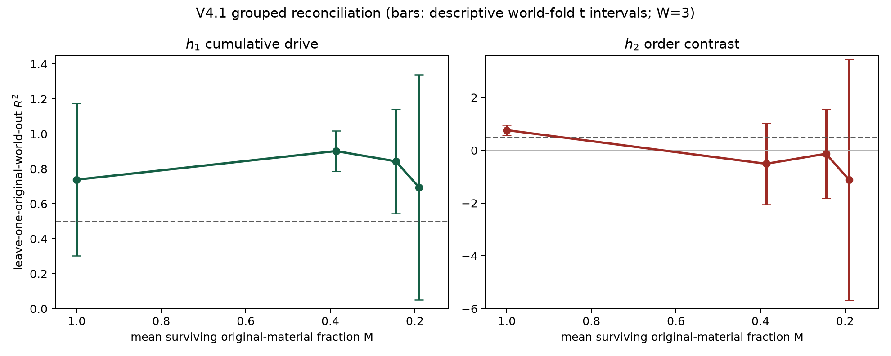
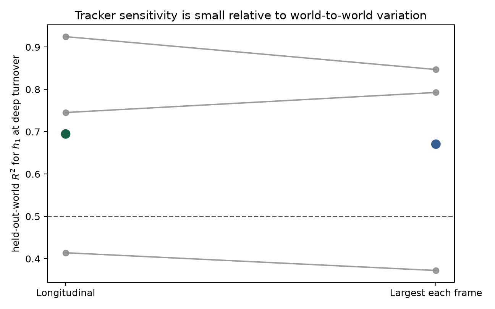
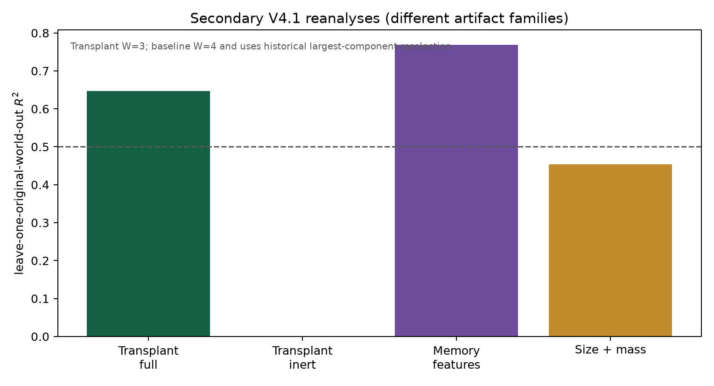

# Organizational-memory claims under original-world grouped validation

## A V4.1 reconciliation of a committed simulation evidence package

Tommy Lepesteur
Methodological reconciliation draft — 16 July 2026

**Manuscript status.** No new simulation was run. V4.0 is preserved unchanged
from Git commit `23b53aee4169deeda30aad2a9dba8587024f8d3d`. V4.1 changes the statistical
analysis and the authorized interpretation, not the underlying trajectories.

## Abstract

Computational evidence can contain many observations but few independent
experimental worlds. We re-examined a committed V4.0 package that reported
decoding of a globally imposed cumulative-drive coordinate from component
features after extensive material replacement. The audit used the original
simulation seed as the outer validation group and did not run or replay any
simulation. The V4.0 point estimate and interval were generated by resampling
12 drive histories with replacement and assigning duplicate draws new
cross-validation identifiers. All 3,000 realized bootstrap replicates contained
at least one duplicate history, allowing exact rows from an original world to
occur in both training and testing.

Under leave-one-original-world-out validation, the deep-turnover cumulative-drive
point estimate is R²=0.695 across 36 records from three original worlds. The
three held-out-world scores are 0.745, 0.414, and 0.925. A descriptive
world-fold t interval is [0.051, 1.338], and the exact fixed-prediction
world-block percentile range is [0.486, 0.886]. With only three worlds, neither
range is treated as a reliable nominal 95% confidence interval. The prior claim
that a lower bound clears the 0.50 qualification threshold is withdrawn. The
deep-turnover order-contrast estimate is R²=-1.118 and is not established.

Direct counts of 36/36 recorded surviving trajectories, zero recorded
reassignment switches, and mean surviving original-material fraction 0.190 are
reproduced. However, the committed summary artifact does not include component
masks, association edges, alternatives, or fusion events, so event-level
continuity cannot be independently reconstructed. Tracker sensitivity changes
the deep cumulative-drive point only modestly relative to world-to-world
variation. Because the drive was imposed globally, this supports global
informational content under either component-selection rule, not local storage.

The scientifically reconciled conclusion is therefore narrow: a positive
out-of-world point estimate for cumulative-drive information survives, while
the V4.0 certification, fusion-free continuity claim, and local-storage
interpretation do not. All claims and numerical changes are enumerated in a
machine-readable ledger.

**Keywords:** grouped validation; simulation audit; information decoding;
material turnover; leakage; reproducibility; uncertainty

## 1. Purpose and scope

V4.1 asks one question: **Do the published V4 claims and numerical values remain
reproducible under strictly grouped, leakage-free statistical inference?**

The answer has two parts. First, the committed records reproduce the material
fractions, survival counts, switch counts, and the V4.0 history-grouped point
estimates. Second, the load-bearing uncertainty calculation does not survive
when independence is defined at the level at which stochastic worlds were
generated. The corrected analysis consequently narrows both the numerical
claim and its interpretation.

This is an artifact reconciliation, not an extension of the simulation
programme. It contains no unsealed prospective result. It makes no claim of
identity, individual memory, reproduction, heredity, active reconstruction, or
evolution.

## 2. Canonical evidence and preservation

The canonical V4.0 source is the Git object
`23b53aee4169deeda30aad2a9dba8587024f8d3d`, originally at branch
`release/organizational-memory-v1`. The V4.0 release manifest lists 37 files.
Every listed file was extracted from its canonical Git blob and verified
against the manifest SHA-256 value. The preserved V4.0 directory contains the
manuscript source and PDF, supplement source and PDF, claim ledger, statistical
reaudit, release metadata, reproduction package, generated outputs, and the
committed longitudinal raw artifact.

The primary longitudinal artifact contains 36 rows: 12 globally imposed drive
histories observed in each of three simulation-seed worlds. The simulation seed
is therefore the original-world identifier. Rows sharing a seed are not treated
as independent outer-validation observations.

Secondary committed artifacts were used only for bounded reanalysis:

- a common-recipient transplant artifact with 36 records from three donor
  worlds and one fixed recipient body;
- an in-place response artifact with 24 records from two original worlds;
- a historical body-baseline artifact with 48 records from four original
  worlds, generated with largest-component reselection.

No missing event trajectory was reconstructed, and no simulator or physics
engine was called.

## 3. Statistical reconciliation

### 3.1 Leakage mechanism in V4.0

V4.0 resampled the 12 history groups with replacement. Each draw was copied
into a new bootstrap data set and assigned a new fold identifier. When one
history was drawn more than once, identical rows from the same original worlds
received different fold identifiers. A duplicate could then be included in
training while its exact counterpart was included in testing.

The probability that 12 draws with replacement from 12 histories are all
unique is 12!/12¹² = 0.0000537. Thus duplication is expected in 99.9946% of
replicates. Under the fixed V4.0 bootstrap seed, all 3,000 realized replicates
contained at least one duplicate. The old bootstrap distribution therefore
does not represent leakage-free uncertainty for prediction in a new original
world.

This finding does not imply that every V4.0 point estimate is numerically
meaningless. It means that the resampled confidence interval and the
certification derived from it are not valid for the stated generalization
target.

### 3.2 Frozen V4.1 estimator

V4.1 uses ridge regression with penalty λ=1, matching the canonical model
family. For each outer fold:

1. one complete original world is held out;
2. feature means, standard deviations, and constant-column decisions are
   estimated from the remaining worlds only;
3. the model is fit on the remaining worlds;
4. predictions are generated once for the held-out world;
5. no row from the held-out original world enters model fitting or
   preprocessing.

The primary score is pooled out-of-world R². The mean of the normalized
held-out-world losses gives the same displayed fold average. A stricter
crossed sensitivity additionally excludes the matching drive history from the
training worlds for each test row.

### 3.3 Uncertainty without bootstrap refitting

There are only three original worlds in the primary artifact. V4.1 therefore
shows the three fold scores directly. It also reports:

- a descriptive Student-t interval over original-world fold scores; and
- exact ordered resampling of the three fixed out-of-world fold scores.

The second calculation has only 3³=27 ordered resamples. It does not retrain a
cross-validation model after duplicating worlds. Neither calculation is
presented as a reliable nominal 95% interval or used to certify the 0.50
threshold. The inferential limitation is the small number of original worlds,
not the number of rows.

## 4. Results

### 4.1 The V4.0 bootstrap reproduces but is leakage-affected

The canonical reproduction package regenerates the reported V4.0 longitudinal
point estimates, including deep cumulative-drive R²=0.8878 and deep
order-contrast R²=-0.2394. It also regenerates the history-bootstrap interval
[0.8366, 0.9581] for the cumulative coordinate. Code-path inspection and a
deterministic audit of the 3,000 bootstrap samples show that every replicate
contains duplicate histories relabelled as distinct folds. The numerical output
is reproducible; its interpretation as leakage-free uncertainty across new
worlds is not.

### 4.2 Original-world grouping lowers the deep headline and widens uncertainty

The cumulative-drive estimate remains positive at every recorded checkpoint
under leave-one-original-world-out validation. It is 0.7382 initially, 0.9020
at moderate replacement, 0.8432 at the first deep checkpoint, and 0.6947 at the
deep checkpoint. The corresponding crossed world-and-history exclusion
estimates are 0.6021, 0.8842, 0.8041, and 0.6420.

At the deep checkpoint, the three held-out-world scores are:

- world 38502: 0.7454;
- world 38503: 0.4141;
- world 38504: 0.9246.

The descriptive t interval is [0.0513, 1.3381]. Exact resampling of the three
fixed fold scores gives percentile endpoints [0.4859, 0.8858]. Because only
three independent worlds are present, these ranges primarily display
heterogeneity. Neither supports a lower bound above the 0.50 qualification
threshold. The V4.0 `CERTIFIED` disposition is withdrawn.

The order-contrast estimate is 0.7631 initially but becomes -0.5102 at moderate
replacement, -0.1315 at the first deep checkpoint, and -1.1183 at the deep
checkpoint. Deep order information is not established.

*Figure 1. Original-world grouped longitudinal reconciliation. Points are
pooled leave-one-original-world-out R² values from n=36 records, W=3 original
worlds, and H=12 globally imposed histories at each checkpoint. Bars are
descriptive t intervals over the three original-world fold scores, not nominal
high-confidence intervals. The dashed line is the predeclared R²=0.50
qualification threshold. Mean surviving original-material fractions are shown
on the horizontal axis; the deep mean is M=0.1902.*

### 4.3 Tracker continuity and fusion correction

The committed summary artifact directly reproduces 36/36 recorded surviving
trajectories, zero lost records, zero recorded reassignment switches, mean deep
M=0.1902, and 34/36 deep records at or below M=0.25.

The deep cumulative-drive estimate is 0.6947 with longitudinal tracking and
0.6706 with largest-component selection at each frame. Across the three worlds,
the paired longitudinal-minus-largest differences are -0.0474, 0.0419, and
0.0777, for a mean difference of 0.0241. Tracker choice is therefore small
relative to observed world variation for this summary decode.

This agreement does not verify event-level continuity. The raw summary contains
lost and switch flags, but not the component masks, candidate association
edges, gate terms, ambiguity alternatives, or merge/fusion events needed to
audit a fusion decision. V4.1 retains the recorded counts and withdraws the
stronger fusion-free interpretation.

*Figure 2. Tracker sensitivity at the deep checkpoint. Grey pairs are the
held-out R² values for each of W=3 original worlds; colored points are pooled
values from n=36 records and H=12 histories. Longitudinal tracking yields
R²=0.6947 and largest-component reselection yields R²=0.6706. The plot supports
a descriptive tracker-sensitivity statement only; absent event-level evidence,
it does not certify fusion handling or identify a local storage site.*

### 4.4 Secondary committed-artifact reanalyses

In the common-recipient transplant artifact, the fixed five-dimensional
response vector gives cumulative-drive R²=0.6468 under donor-world outer
validation. Fold scores are 0.6568, 0.6972, and 0.5863 across W=3 donor worlds.
The stricter crossed world-and-history estimate is 0.4807. The inert and erased
responses are constant and score R²=0 under world-held-out validation. These
results support the bounded statement that globally written field values carry
cumulative-drive information into one fixed recipient response and that
readout removal eliminates that information. They do not establish
generalization across recipient bodies.

The in-place response estimate is R²=0.7039 but is based on W=2 worlds and is
descriptive only.

In the historical W=4 body-baseline artifact, deep component-memory features
score 0.7692 and size-plus-mass features score 0.4538. The paired mean
difference is 0.3154, with a descriptive t interval [-0.2394, 0.8701]. The point
favors component features, but the comparison is not separated. This artifact
also used largest-component reselection and is not a direct local-versus-global
access comparison.

*Figure 3. Secondary reanalyses from different committed artifact families.
The transplant bars use n=36 records, W=3 donor worlds, H=12 histories, and one
fixed recipient body. The deep body-baseline bars use n=48 records, W=4
original worlds, H=12 histories, and historical largest-component reselection.
No uncertainty bars are combined because the bars do not share one experimental
family. The dashed line marks R²=0.50.*

### 4.5 Global informational content is not a local-storage estimate

Every history in the primary design was imposed at whole-world level. A model
trained on component features can therefore decode a world-level coordinate
without demonstrating that the tracked component is the unique or local
storage site. The V4 artifacts do not provide frozen access structures that
compare the tracked component with neighbouring components, the surrounding
environment, or whole-world features under the same outer folds.

The tracker comparison shows that two component-selection rules retain similar
access to the globally imposed signal. It cannot distinguish whether the
information is concentrated locally, redundantly distributed, or recoverable
from broader world state. V4.1 consequently uses the term **global
informational content** and withdraws local-storage wording.

## 5. Numerical and claim reconciliation

The following headline dispositions govern the manuscript, supplement, figures,
machine-readable JSON, and cover letter.

| Quantity | V4.0 canonical | V4.1 grouped result | Disposition |
|---|---:|---:|---|
| Deep cumulative-drive R² | 0.8878 | 0.6947 | CORRECTED |
| Deep cumulative-drive interval | [0.8366, 0.9581] | descriptive t [0.0513, 1.3381] | WITHDRAWN |
| Deep threshold verdict | certified | not established | WITHDRAWN |
| Deep order-contrast R² | -0.2394 | -1.1183 | CORRECTED |
| Track survival | 36/36 | 36/36 recorded | UNCHANGED |
| Recorded switches | 0 | 0 | UNCHANGED |
| Mean deep M | 0.1902 | 0.1902 | UNCHANGED |
| Longitudinal / largest deep R² | 0.8878 / 0.9123 | 0.6947 / 0.6706 | CORRECTED |
| Common-recipient transplant R² | 0.61 | 0.6468 | CORRECTED |
| Inert / erased response R² | -0.19 / -0.19 | 0 / 0 | CORRECTED |
| Deep memory / size-plus-mass R² | 0.93 / 0.64 | 0.7692 / 0.4538 | CORRECTED |
| Fusion-free continuity | implicit | not reconstructable | WITHDRAWN |
| Local storage | stated | unresolved | WITHDRAWN |

The complete reconciliation table and claim ledger are supplied as Markdown,
CSV, and JSON. No narrative claim is authorized unless it matches that ledger.

## 6. Discussion

The reconciliation illustrates why the effective sample size in a simulation
study is determined by the target of generalization. The primary artifact has
36 rows, but those rows arise from only three stochastic worlds. Histories are
useful within-world interventions; they do not replace independent worlds when
the claim concerns out-of-world prediction.

The positive cumulative-drive point is reasonably stable across two
component-selection rules and remains positive under the crossed
world-and-history exclusion sensitivity. That is meaningful evidence that the
committed feature vectors contain global history-related information after
substantial material replacement. It is not enough to estimate a reliable
lower confidence bound, certify the 0.50 gate, prove event-level continuity, or
locate storage.

The correction also separates reproducibility from validity. V4.0 is
reproducible in the narrow computational sense: its package regenerates its
numbers. The concern is methodological: duplicate bootstrap draws were treated
as new folds, so the resulting interval does not answer the claimed
out-of-world question. V4.1 preserves both facts rather than replacing the
historical record.

### Limitations

Only three original worlds support the primary headline, two support the
in-place response result, and four support the historical body baseline.
World-fold intervals are therefore descriptive. The summary artifact is
insufficient for an event-level tracker audit. The common-recipient transplant
does not estimate recipient-to-recipient generalization. The globally imposed
histories do not identify a local storage site. Finally, the reanalysis is
limited to committed feature vectors and cannot recover evidence that was never
persisted.

## 7. Conclusion

Under strictly grouped, leakage-free outer validation, the V4.0 qualitative
observation survives only in narrowed form: component features retain a
positive out-of-world point estimate for a globally imposed cumulative-drive
coordinate after extensive material replacement. The corrected deep estimate
is R²=0.6947 across three original worlds.

The V4.0 confidence interval and certification do not survive. Deep order
information is not established. Recorded survival and switch counts reproduce,
but event-level fusion handling cannot be reconstructed. The artifacts
demonstrate global informational content, not local storage.

**Final scientific verdict: MAJOR REPAIR STILL REQUIRED.**

**Data, code, and audit availability.** The V4.0 blob-preserved package, V4.1
source, PDFs, analysis script, row-level
out-of-fold predictions, numerical reconciliation table, errata ledger, claim
ledger, headline-results JSON, cover letter draft, French summary, and visual
QA report are contained in
`paper/organizational-memory-v4-1-reconciliation/`.

The exact analysis and build commands are listed in `REPRODUCIBILITY.md`.
